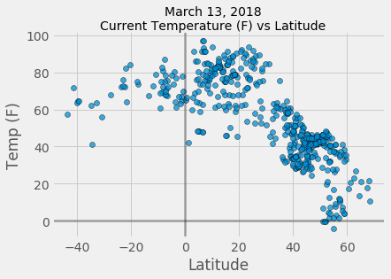
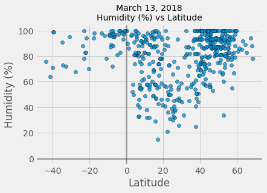
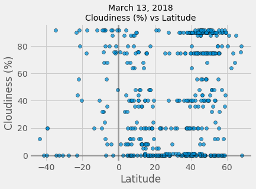
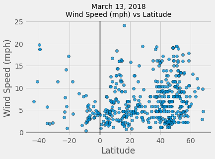

# Observed Trends:
- Not surprisingly, we can see the negative correlation between absolute value of latitude and temperature. However, a majority of the data points are pulled from cities north of the equator
- At the observed time, latitudes between 0-20 and 40-60 were seeing high humidity percentages while the gap between 40-60 was much lower
- Cloudiness and wind speed didn't seem to have any correlation with latitude based on the observed conditions


```python
import csv
import requests
import json
from citipy import citipy
from config import api_key
import pandas as pd
import numpy as np
import matplotlib.pyplot as plt
import time
```


```python
# time.strftime('%B %d, %Y')
```


```python
# Pull 500 random samples from citipy worldcities.csv (Over 45k cities in csv)
cities_df = pd.read_csv("https://raw.githubusercontent.com/wingchen/citipy/master/citipy/worldcities.csv").sample(n=500)
cities_df.head()
```


<div>
<style>
    .dataframe thead tr:only-child th {
        text-align: right;
    }

    .dataframe thead th {
        text-align: left;
    }

    .dataframe tbody tr th {
        vertical-align: top;
    }
</style>
<table border="1" class="dataframe">
  <thead>
    <tr style="text-align: right;">
      <th></th>
      <th>Country</th>
      <th>City</th>
      <th>Latitude</th>
      <th>Longitude</th>
    </tr>
  </thead>
  <tbody>
    <tr>
      <th>12007</th>
      <td>fr</td>
      <td>saint-etienne</td>
      <td>45.435382</td>
      <td>4.391051</td>
    </tr>
    <tr>
      <th>44278</th>
      <td>us</td>
      <td>columbia</td>
      <td>38.951667</td>
      <td>-92.333889</td>
    </tr>
    <tr>
      <th>14150</th>
      <td>gr</td>
      <td>plomarion</td>
      <td>38.976667</td>
      <td>26.368056</td>
    </tr>
    <tr>
      <th>15593</th>
      <td>hu</td>
      <td>gyor</td>
      <td>47.687281</td>
      <td>17.637616</td>
    </tr>
    <tr>
      <th>27913</th>
      <td>ph</td>
      <td>claveria</td>
      <td>12.903500</td>
      <td>123.245700</td>
    </tr>
  </tbody>
</table>
</div>


```python
# Assign base url
url = "http://api.openweathermap.org/data/2.5/weather?"

# Create counter
counter = 1

# Create new columns to store new API data
cities_df['Temperature (F)'] = ""
cities_df['Humidity (%)'] = ""
cities_df['Cloudiness (%)'] = ""
cities_df['Wind Speed (mph)'] = ""


# Loop through cities rows
for index, row in cities_df.iterrows():
    
    # Create lat and lon vars
    lat = round(row['Latitude'], 2)
    lon = round(row['Longitude'], 2)

    # Create params and generate API resonse
    params = {"appid": api_key, "lat": lat, "lon": lon, "units": "imperial"}
    response = requests.get(url, params=params)
    response_json = response.json()
    
    # Store relevant vars
    city_name = response_json['name']
    temp = response_json['main']['temp']
    humidity = response_json['main']['humidity']
    cloudiness = response_json['clouds']['all']
    wind_speed = response_json['wind']['speed']
    
#     # Write vars to DF
    cities_df.set_value(index, "Temperature (F)", temp)
    cities_df.set_value(index, "Humidity (%)", humidity)
    cities_df.set_value(index, "Cloudiness (%)", cloudiness)
    cities_df.set_value(index, "Wind Speed (mph)", wind_speed)
    
    # Print log
    print(f"Requesting City #{counter}: {city_name}, URL: {response.url}")
    print("---------------------------------------------------------------")
    
    # Add to Counter
    counter = counter + 1

cities_df.head()
```

    Requesting City #1: Saint-Etienne, URL: http://api.openweathermap.org/data/2.5/weather?appid=ccafc75a70c2015a73008b45469e478c&lat=45.44&lon=4.39&units=imperial
    ---------------------------------------------------------------
    Requesting City #2: Columbia, URL: http://api.openweathermap.org/data/2.5/weather?appid=ccafc75a70c2015a73008b45469e478c&lat=38.95&lon=-92.33&units=imperial
    ---------------------------------------------------------------
    Requesting City #3: Plomarion, URL: http://api.openweathermap.org/data/2.5/weather?appid=ccafc75a70c2015a73008b45469e478c&lat=38.98&lon=26.37&units=imperial
    ---------------------------------------------------------------
    Requesting City #4: Gyor, URL: http://api.openweathermap.org/data/2.5/weather?appid=ccafc75a70c2015a73008b45469e478c&lat=47.69&lon=17.64&units=imperial
    ---------------------------------------------------------------
    Requesting City #5: Claveria, URL: http://api.openweathermap.org/data/2.5/weather?appid=ccafc75a70c2015a73008b45469e478c&lat=12.9&lon=123.25&units=imperial
    ---------------------------------------------------------------
    Requesting City #6: Jibert, URL: http://api.openweathermap.org/data/2.5/weather?appid=ccafc75a70c2015a73008b45469e478c&lat=46.0&lon=25.07&units=imperial
    ---------------------------------------------------------------
    Requesting City #7: El Socorro, URL: http://api.openweathermap.org/data/2.5/weather?appid=ccafc75a70c2015a73008b45469e478c&lat=14.63&lon=-87.92&units=imperial
    ---------------------------------------------------------------
    Requesting City #8: Canutama, URL: http://api.openweathermap.org/data/2.5/weather?appid=ccafc75a70c2015a73008b45469e478c&lat=-6.53&lon=-64.33&units=imperial
    ---------------------------------------------------------------
    Requesting City #9: Colombia, URL: http://api.openweathermap.org/data/2.5/weather?appid=ccafc75a70c2015a73008b45469e478c&lat=3.38&lon=-74.8&units=imperial
    ---------------------------------------------------------------
    Requesting City #10: Valle de San Jose, URL: http://api.openweathermap.org/data/2.5/weather?appid=ccafc75a70c2015a73008b45469e478c&lat=6.42&lon=-73.17&units=imperial
    ---------------------------------------------------------------
    Requesting City #11: Novato, URL: http://api.openweathermap.org/data/2.5/weather?appid=ccafc75a70c2015a73008b45469e478c&lat=38.11&lon=-122.57&units=imperial
    ---------------------------------------------------------------
    Requesting City #12: Traian, URL: http://api.openweathermap.org/data/2.5/weather?appid=ccafc75a70c2015a73008b45469e478c&lat=46.63&lon=27.03&units=imperial
    ---------------------------------------------------------------
    Requesting City #13: Carapicuiba, URL: http://api.openweathermap.org/data/2.5/weather?appid=ccafc75a70c2015a73008b45469e478c&lat=-23.52&lon=-46.83&units=imperial
    ---------------------------------------------------------------
    Requesting City #14: Boavita, URL: http://api.openweathermap.org/data/2.5/weather?appid=ccafc75a70c2015a73008b45469e478c&lat=6.33&lon=-72.59&units=imperial
    ---------------------------------------------------------------
    Requesting City #15: Starobaltachevo, URL: http://api.openweathermap.org/data/2.5/weather?appid=ccafc75a70c2015a73008b45469e478c&lat=56.0&lon=55.92&units=imperial
    ---------------------------------------------------------------
    Requesting City #16: Masaguisi, URL: http://api.openweathermap.org/data/2.5/weather?appid=ccafc75a70c2015a73008b45469e478c&lat=12.75&lon=121.45&units=imperial
    ---------------------------------------------------------------
    Requesting City #17: Gyulagarak, URL: http://api.openweathermap.org/data/2.5/weather?appid=ccafc75a70c2015a73008b45469e478c&lat=40.95&lon=44.47&units=imperial
    ---------------------------------------------------------------
    Requesting City #18: Vizovice, URL: http://api.openweathermap.org/data/2.5/weather?appid=ccafc75a70c2015a73008b45469e478c&lat=49.22&lon=17.85&units=imperial
    ---------------------------------------------------------------
    Requesting City #19: Las Vegas, URL: http://api.openweathermap.org/data/2.5/weather?appid=ccafc75a70c2015a73008b45469e478c&lat=36.17&lon=-115.14&units=imperial
    ---------------------------------------------------------------
    Requesting City #20: Suseni, URL: http://api.openweathermap.org/data/2.5/weather?appid=ccafc75a70c2015a73008b45469e478c&lat=46.82&lon=24.75&units=imperial
    ---------------------------------------------------------------
    Requesting City #21: Mestrino, URL: http://api.openweathermap.org/data/2.5/weather?appid=ccafc75a70c2015a73008b45469e478c&lat=45.43&lon=11.78&units=imperial
    ---------------------------------------------------------------
    Requesting City #22: Saint-Martin-des-Champs, URL: http://api.openweathermap.org/data/2.5/weather?appid=ccafc75a70c2015a73008b45469e478c&lat=48.59&lon=-3.83&units=imperial
    ---------------------------------------------------------------
    Requesting City #23: Hewitt, URL: http://api.openweathermap.org/data/2.5/weather?appid=ccafc75a70c2015a73008b45469e478c&lat=31.46&lon=-97.2&units=imperial
    ---------------------------------------------------------------
    Requesting City #24: Provincie Overijssel, URL: http://api.openweathermap.org/data/2.5/weather?appid=ccafc75a70c2015a73008b45469e478c&lat=52.39&lon=6.45&units=imperial
    ---------------------------------------------------------------
    Requesting City #25: Alfred, URL: http://api.openweathermap.org/data/2.5/weather?appid=ccafc75a70c2015a73008b45469e478c&lat=45.55&lon=-74.87&units=imperial
    ---------------------------------------------------------------
    Requesting City #26: Ciugud, URL: http://api.openweathermap.org/data/2.5/weather?appid=ccafc75a70c2015a73008b45469e478c&lat=46.05&lon=23.62&units=imperial
    ---------------------------------------------------------------
    Requesting City #27: Santa Ana Huiloac, URL: http://api.openweathermap.org/data/2.5/weather?appid=ccafc75a70c2015a73008b45469e478c&lat=19.4&lon=-98.15&units=imperial
    ---------------------------------------------------------------
    Requesting City #28: Vladeni, URL: http://api.openweathermap.org/data/2.5/weather?appid=ccafc75a70c2015a73008b45469e478c&lat=47.72&lon=26.52&units=imperial
    ---------------------------------------------------------------
    Requesting City #29: Rokupr, URL: http://api.openweathermap.org/data/2.5/weather?appid=ccafc75a70c2015a73008b45469e478c&lat=8.67&lon=-12.39&units=imperial
    ---------------------------------------------------------------
    Requesting City #30: Faridabad, URL: http://api.openweathermap.org/data/2.5/weather?appid=ccafc75a70c2015a73008b45469e478c&lat=28.43&lon=77.32&units=imperial
    ---------------------------------------------------------------
    Requesting City #31: Panarukan, URL: http://api.openweathermap.org/data/2.5/weather?appid=ccafc75a70c2015a73008b45469e478c&lat=-7.7&lon=113.95&units=imperial
    ---------------------------------------------------------------
    Requesting City #32: Okha, URL: http://api.openweathermap.org/data/2.5/weather?appid=ccafc75a70c2015a73008b45469e478c&lat=22.47&lon=69.06&units=imperial
    ---------------------------------------------------------------
    Requesting City #33: Gemeente Hoorn, URL: http://api.openweathermap.org/data/2.5/weather?appid=ccafc75a70c2015a73008b45469e478c&lat=52.65&lon=5.06&units=imperial
    ---------------------------------------------------------------
    Requesting City #34: El Rincon, URL: http://api.openweathermap.org/data/2.5/weather?appid=ccafc75a70c2015a73008b45469e478c&lat=14.58&lon=-87.93&units=imperial
    ---------------------------------------------------------------
    Requesting City #35: Islahiye, URL: http://api.openweathermap.org/data/2.5/weather?appid=ccafc75a70c2015a73008b45469e478c&lat=37.02&lon=36.63&units=imperial
    ---------------------------------------------------------------
    Requesting City #36: Vandavasi, URL: http://api.openweathermap.org/data/2.5/weather?appid=ccafc75a70c2015a73008b45469e478c&lat=12.5&lon=79.62&units=imperial
    ---------------------------------------------------------------
    Requesting City #37: Katangawan, URL: http://api.openweathermap.org/data/2.5/weather?appid=ccafc75a70c2015a73008b45469e478c&lat=6.17&lon=125.22&units=imperial
    ---------------------------------------------------------------
    Requesting City #38: San Nicolas de los Garza, URL: http://api.openweathermap.org/data/2.5/weather?appid=ccafc75a70c2015a73008b45469e478c&lat=25.75&lon=-100.3&units=imperial
    ---------------------------------------------------------------
    Requesting City #39: Dulce Grande, URL: http://api.openweathermap.org/data/2.5/weather?appid=ccafc75a70c2015a73008b45469e478c&lat=23.0&lon=-102.17&units=imperial
    ---------------------------------------------------------------
    Requesting City #40: Beceni, URL: http://api.openweathermap.org/data/2.5/weather?appid=ccafc75a70c2015a73008b45469e478c&lat=45.38&lon=26.78&units=imperial
    ---------------------------------------------------------------
    Requesting City #41: Lechinkay, URL: http://api.openweathermap.org/data/2.5/weather?appid=ccafc75a70c2015a73008b45469e478c&lat=43.56&lon=43.43&units=imperial
    ---------------------------------------------------------------
    Requesting City #42: Stadthagen, URL: http://api.openweathermap.org/data/2.5/weather?appid=ccafc75a70c2015a73008b45469e478c&lat=52.32&lon=9.2&units=imperial
    ---------------------------------------------------------------
    Requesting City #43: Sueca, URL: http://api.openweathermap.org/data/2.5/weather?appid=ccafc75a70c2015a73008b45469e478c&lat=39.2&lon=-0.32&units=imperial
    ---------------------------------------------------------------
    Requesting City #44: Comana, URL: http://api.openweathermap.org/data/2.5/weather?appid=ccafc75a70c2015a73008b45469e478c&lat=43.9&lon=28.32&units=imperial
    ---------------------------------------------------------------
    Requesting City #45: Obita, URL: http://api.openweathermap.org/data/2.5/weather?appid=ccafc75a70c2015a73008b45469e478c&lat=32.82&lon=129.88&units=imperial
    ---------------------------------------------------------------
    Requesting City #46: White Bear Lake, URL: http://api.openweathermap.org/data/2.5/weather?appid=ccafc75a70c2015a73008b45469e478c&lat=45.08&lon=-93.01&units=imperial
    ---------------------------------------------------------------
    Requesting City #47: Moers, URL: http://api.openweathermap.org/data/2.5/weather?appid=ccafc75a70c2015a73008b45469e478c&lat=51.45&lon=6.65&units=imperial
    ---------------------------------------------------------------
    Requesting City #48: Padampur, URL: http://api.openweathermap.org/data/2.5/weather?appid=ccafc75a70c2015a73008b45469e478c&lat=20.98&lon=83.07&units=imperial
    ---------------------------------------------------------------
    Requesting City #49: Cumanayagua, URL: http://api.openweathermap.org/data/2.5/weather?appid=ccafc75a70c2015a73008b45469e478c&lat=22.15&lon=-80.2&units=imperial
    ---------------------------------------------------------------
    Requesting City #50: Chaska, URL: http://api.openweathermap.org/data/2.5/weather?appid=ccafc75a70c2015a73008b45469e478c&lat=44.79&lon=-93.6&units=imperial
    ---------------------------------------------------------------
    Requesting City #51: Hatfield, URL: http://api.openweathermap.org/data/2.5/weather?appid=ccafc75a70c2015a73008b45469e478c&lat=53.57&lon=-0.98&units=imperial
    ---------------------------------------------------------------
    Requesting City #52: Binalonan, URL: http://api.openweathermap.org/data/2.5/weather?appid=ccafc75a70c2015a73008b45469e478c&lat=16.08&lon=120.61&units=imperial
    ---------------------------------------------------------------
    Requesting City #53: Khuzhir, URL: http://api.openweathermap.org/data/2.5/weather?appid=ccafc75a70c2015a73008b45469e478c&lat=53.19&lon=107.34&units=imperial
    ---------------------------------------------------------------
    Requesting City #54: Ouadda, URL: http://api.openweathermap.org/data/2.5/weather?appid=ccafc75a70c2015a73008b45469e478c&lat=8.07&lon=22.4&units=imperial
    ---------------------------------------------------------------
    Requesting City #55: Assare, URL: http://api.openweathermap.org/data/2.5/weather?appid=ccafc75a70c2015a73008b45469e478c&lat=-6.87&lon=-39.87&units=imperial
    ---------------------------------------------------------------
    Requesting City #56: Pueblo Nuevo, URL: http://api.openweathermap.org/data/2.5/weather?appid=ccafc75a70c2015a73008b45469e478c&lat=-7.19&lon=-79.52&units=imperial
    ---------------------------------------------------------------
    Requesting City #57: Beitbridge, URL: http://api.openweathermap.org/data/2.5/weather?appid=ccafc75a70c2015a73008b45469e478c&lat=-22.22&lon=30.0&units=imperial
    ---------------------------------------------------------------
    Requesting City #58: Opa-locka, URL: http://api.openweathermap.org/data/2.5/weather?appid=ccafc75a70c2015a73008b45469e478c&lat=25.9&lon=-80.25&units=imperial
    ---------------------------------------------------------------
    Requesting City #59: Saundatti, URL: http://api.openweathermap.org/data/2.5/weather?appid=ccafc75a70c2015a73008b45469e478c&lat=15.78&lon=75.12&units=imperial
    ---------------------------------------------------------------
    Requesting City #60: Selianitika, URL: http://api.openweathermap.org/data/2.5/weather?appid=ccafc75a70c2015a73008b45469e478c&lat=38.28&lon=22.03&units=imperial
    ---------------------------------------------------------------
    Requesting City #61: Vavatenina, URL: http://api.openweathermap.org/data/2.5/weather?appid=ccafc75a70c2015a73008b45469e478c&lat=-17.47&lon=49.2&units=imperial
    ---------------------------------------------------------------
    Requesting City #62: Houlton, URL: http://api.openweathermap.org/data/2.5/weather?appid=ccafc75a70c2015a73008b45469e478c&lat=46.13&lon=-67.84&units=imperial
    ---------------------------------------------------------------
    Requesting City #63: Huanshi, URL: http://api.openweathermap.org/data/2.5/weather?appid=ccafc75a70c2015a73008b45469e478c&lat=23.03&lon=113.13&units=imperial
    ---------------------------------------------------------------
    Requesting City #64: Martinez, URL: http://api.openweathermap.org/data/2.5/weather?appid=ccafc75a70c2015a73008b45469e478c&lat=38.02&lon=-122.13&units=imperial
    ---------------------------------------------------------------
    Requesting City #65: Abbadia Lariana, URL: http://api.openweathermap.org/data/2.5/weather?appid=ccafc75a70c2015a73008b45469e478c&lat=45.9&lon=9.32&units=imperial
    ---------------------------------------------------------------
    Requesting City #66: Unirea, URL: http://api.openweathermap.org/data/2.5/weather?appid=ccafc75a70c2015a73008b45469e478c&lat=45.62&lon=22.88&units=imperial
    ---------------------------------------------------------------
    Requesting City #67: Thoen, URL: http://api.openweathermap.org/data/2.5/weather?appid=ccafc75a70c2015a73008b45469e478c&lat=17.61&lon=99.22&units=imperial
    ---------------------------------------------------------------
    Requesting City #68: Woodland Park, URL: http://api.openweathermap.org/data/2.5/weather?appid=ccafc75a70c2015a73008b45469e478c&lat=40.89&lon=-74.2&units=imperial
    ---------------------------------------------------------------
    Requesting City #69: Klembivka, URL: http://api.openweathermap.org/data/2.5/weather?appid=ccafc75a70c2015a73008b45469e478c&lat=48.39&lon=28.41&units=imperial
    ---------------------------------------------------------------
    Requesting City #70: Concepcion, URL: http://api.openweathermap.org/data/2.5/weather?appid=ccafc75a70c2015a73008b45469e478c&lat=15.33&lon=120.67&units=imperial
    ---------------------------------------------------------------
    Requesting City #71: San Bartolome Jocotenango, URL: http://api.openweathermap.org/data/2.5/weather?appid=ccafc75a70c2015a73008b45469e478c&lat=15.19&lon=-91.08&units=imperial
    ---------------------------------------------------------------
    Requesting City #72: Limay, URL: http://api.openweathermap.org/data/2.5/weather?appid=ccafc75a70c2015a73008b45469e478c&lat=14.56&lon=120.6&units=imperial
    ---------------------------------------------------------------
    Requesting City #73: Kimitsu, URL: http://api.openweathermap.org/data/2.5/weather?appid=ccafc75a70c2015a73008b45469e478c&lat=35.33&lon=139.89&units=imperial
    ---------------------------------------------------------------
    Requesting City #74: Quisao, URL: http://api.openweathermap.org/data/2.5/weather?appid=ccafc75a70c2015a73008b45469e478c&lat=14.43&lon=121.33&units=imperial
    ---------------------------------------------------------------
    Requesting City #75: Gondanglegi Wetan, URL: http://api.openweathermap.org/data/2.5/weather?appid=ccafc75a70c2015a73008b45469e478c&lat=-8.18&lon=112.64&units=imperial
    ---------------------------------------------------------------
    Requesting City #76: Caramoran, URL: http://api.openweathermap.org/data/2.5/weather?appid=ccafc75a70c2015a73008b45469e478c&lat=13.98&lon=124.13&units=imperial
    ---------------------------------------------------------------
    Requesting City #77: Novokuznetsk, URL: http://api.openweathermap.org/data/2.5/weather?appid=ccafc75a70c2015a73008b45469e478c&lat=53.76&lon=87.11&units=imperial
    ---------------------------------------------------------------
    Requesting City #78: Tausa, URL: http://api.openweathermap.org/data/2.5/weather?appid=ccafc75a70c2015a73008b45469e478c&lat=5.2&lon=-73.89&units=imperial
    ---------------------------------------------------------------
    Requesting City #79: Montana, URL: http://api.openweathermap.org/data/2.5/weather?appid=ccafc75a70c2015a73008b45469e478c&lat=43.41&lon=23.23&units=imperial
    ---------------------------------------------------------------
    Requesting City #80: Qingyuan, URL: http://api.openweathermap.org/data/2.5/weather?appid=ccafc75a70c2015a73008b45469e478c&lat=23.7&lon=113.03&units=imperial
    ---------------------------------------------------------------
    Requesting City #81: Baykalovo, URL: http://api.openweathermap.org/data/2.5/weather?appid=ccafc75a70c2015a73008b45469e478c&lat=57.4&lon=63.77&units=imperial
    ---------------------------------------------------------------
    Requesting City #82: Ano Mera, URL: http://api.openweathermap.org/data/2.5/weather?appid=ccafc75a70c2015a73008b45469e478c&lat=37.45&lon=25.4&units=imperial
    ---------------------------------------------------------------
    Requesting City #83: Parksville, URL: http://api.openweathermap.org/data/2.5/weather?appid=ccafc75a70c2015a73008b45469e478c&lat=49.3&lon=-124.32&units=imperial
    ---------------------------------------------------------------
    Requesting City #84: Entre Rios, URL: http://api.openweathermap.org/data/2.5/weather?appid=ccafc75a70c2015a73008b45469e478c&lat=-21.53&lon=-64.2&units=imperial
    ---------------------------------------------------------------
    Requesting City #85: Komsomolsk-na-Amure, URL: http://api.openweathermap.org/data/2.5/weather?appid=ccafc75a70c2015a73008b45469e478c&lat=50.55&lon=137.02&units=imperial
    ---------------------------------------------------------------
    Requesting City #86: Waterloo, URL: http://api.openweathermap.org/data/2.5/weather?appid=ccafc75a70c2015a73008b45469e478c&lat=8.34&lon=-13.07&units=imperial
    ---------------------------------------------------------------
    Requesting City #87: Sulur, URL: http://api.openweathermap.org/data/2.5/weather?appid=ccafc75a70c2015a73008b45469e478c&lat=11.03&lon=77.13&units=imperial
    ---------------------------------------------------------------
    Requesting City #88: Manay, URL: http://api.openweathermap.org/data/2.5/weather?appid=ccafc75a70c2015a73008b45469e478c&lat=7.21&lon=126.54&units=imperial
    ---------------------------------------------------------------
    Requesting City #89: Zalantun, URL: http://api.openweathermap.org/data/2.5/weather?appid=ccafc75a70c2015a73008b45469e478c&lat=48.0&lon=122.72&units=imperial
    ---------------------------------------------------------------
    Requesting City #90: Bury St Edmunds, URL: http://api.openweathermap.org/data/2.5/weather?appid=ccafc75a70c2015a73008b45469e478c&lat=52.25&lon=0.72&units=imperial
    ---------------------------------------------------------------
    Requesting City #91: Lauenen, URL: http://api.openweathermap.org/data/2.5/weather?appid=ccafc75a70c2015a73008b45469e478c&lat=46.41&lon=7.34&units=imperial
    ---------------------------------------------------------------
    Requesting City #92: Kalutara, URL: http://api.openweathermap.org/data/2.5/weather?appid=ccafc75a70c2015a73008b45469e478c&lat=6.58&lon=79.97&units=imperial
    ---------------------------------------------------------------
    Requesting City #93: Monetnyy, URL: http://api.openweathermap.org/data/2.5/weather?appid=ccafc75a70c2015a73008b45469e478c&lat=57.05&lon=60.88&units=imperial
    ---------------------------------------------------------------
    Requesting City #94: Saint Hubert, URL: http://api.openweathermap.org/data/2.5/weather?appid=ccafc75a70c2015a73008b45469e478c&lat=-20.36&lon=57.64&units=imperial
    ---------------------------------------------------------------
    Requesting City #95: Musayelyan, URL: http://api.openweathermap.org/data/2.5/weather?appid=ccafc75a70c2015a73008b45469e478c&lat=40.77&lon=43.99&units=imperial
    ---------------------------------------------------------------
    Requesting City #96: Perevoz, URL: http://api.openweathermap.org/data/2.5/weather?appid=ccafc75a70c2015a73008b45469e478c&lat=55.6&lon=44.54&units=imperial
    ---------------------------------------------------------------
    Requesting City #97: Murahid, URL: http://api.openweathermap.org/data/2.5/weather?appid=ccafc75a70c2015a73008b45469e478c&lat=46.43&lon=16.73&units=imperial
    ---------------------------------------------------------------
    Requesting City #98: Pong, URL: http://api.openweathermap.org/data/2.5/weather?appid=ccafc75a70c2015a73008b45469e478c&lat=19.15&lon=100.28&units=imperial
    ---------------------------------------------------------------
    Requesting City #99: Zarubino, URL: http://api.openweathermap.org/data/2.5/weather?appid=ccafc75a70c2015a73008b45469e478c&lat=58.73&lon=33.48&units=imperial
    ---------------------------------------------------------------
    Requesting City #100: Zhirnovsk, URL: http://api.openweathermap.org/data/2.5/weather?appid=ccafc75a70c2015a73008b45469e478c&lat=50.98&lon=44.77&units=imperial
    ---------------------------------------------------------------
    Requesting City #101: Dubrovka, URL: http://api.openweathermap.org/data/2.5/weather?appid=ccafc75a70c2015a73008b45469e478c&lat=53.69&lon=33.51&units=imperial
    ---------------------------------------------------------------
    Requesting City #102: Gursu, URL: http://api.openweathermap.org/data/2.5/weather?appid=ccafc75a70c2015a73008b45469e478c&lat=40.22&lon=29.19&units=imperial
    ---------------------------------------------------------------
    Requesting City #103: Bafang, URL: http://api.openweathermap.org/data/2.5/weather?appid=ccafc75a70c2015a73008b45469e478c&lat=5.15&lon=10.18&units=imperial
    ---------------------------------------------------------------
    Requesting City #104: Røros, URL: http://api.openweathermap.org/data/2.5/weather?appid=ccafc75a70c2015a73008b45469e478c&lat=62.58&lon=11.4&units=imperial
    ---------------------------------------------------------------
    Requesting City #105: Lopatinskiy, URL: http://api.openweathermap.org/data/2.5/weather?appid=ccafc75a70c2015a73008b45469e478c&lat=55.34&lon=38.72&units=imperial
    ---------------------------------------------------------------
    Requesting City #106: Verano Brianza, URL: http://api.openweathermap.org/data/2.5/weather?appid=ccafc75a70c2015a73008b45469e478c&lat=45.7&lon=9.23&units=imperial
    ---------------------------------------------------------------
    Requesting City #107: Csokmo, URL: http://api.openweathermap.org/data/2.5/weather?appid=ccafc75a70c2015a73008b45469e478c&lat=47.03&lon=21.3&units=imperial
    ---------------------------------------------------------------
    Requesting City #108: Gore, URL: http://api.openweathermap.org/data/2.5/weather?appid=ccafc75a70c2015a73008b45469e478c&lat=8.15&lon=35.53&units=imperial
    ---------------------------------------------------------------
    Requesting City #109: Catarina, URL: http://api.openweathermap.org/data/2.5/weather?appid=ccafc75a70c2015a73008b45469e478c&lat=14.85&lon=-92.08&units=imperial
    ---------------------------------------------------------------
    Requesting City #110: Engen, URL: http://api.openweathermap.org/data/2.5/weather?appid=ccafc75a70c2015a73008b45469e478c&lat=47.85&lon=8.77&units=imperial
    ---------------------------------------------------------------
    Requesting City #111: San Bernardino, URL: http://api.openweathermap.org/data/2.5/weather?appid=ccafc75a70c2015a73008b45469e478c&lat=17.4&lon=121.75&units=imperial
    ---------------------------------------------------------------
    Requesting City #112: Oia, URL: http://api.openweathermap.org/data/2.5/weather?appid=ccafc75a70c2015a73008b45469e478c&lat=40.54&lon=-8.54&units=imperial
    ---------------------------------------------------------------
    Requesting City #113: Sharhorod, URL: http://api.openweathermap.org/data/2.5/weather?appid=ccafc75a70c2015a73008b45469e478c&lat=48.74&lon=28.08&units=imperial
    ---------------------------------------------------------------
    Requesting City #114: Sawakin, URL: http://api.openweathermap.org/data/2.5/weather?appid=ccafc75a70c2015a73008b45469e478c&lat=19.1&lon=37.33&units=imperial
    ---------------------------------------------------------------
    Requesting City #115: Socodor, URL: http://api.openweathermap.org/data/2.5/weather?appid=ccafc75a70c2015a73008b45469e478c&lat=46.52&lon=21.43&units=imperial
    ---------------------------------------------------------------
    Requesting City #116: Polahongon, URL: http://api.openweathermap.org/data/2.5/weather?appid=ccafc75a70c2015a73008b45469e478c&lat=10.53&lon=124.97&units=imperial
    ---------------------------------------------------------------
    Requesting City #117: Polkowice, URL: http://api.openweathermap.org/data/2.5/weather?appid=ccafc75a70c2015a73008b45469e478c&lat=51.51&lon=16.07&units=imperial
    ---------------------------------------------------------------
    Requesting City #118: Kanonji, URL: http://api.openweathermap.org/data/2.5/weather?appid=ccafc75a70c2015a73008b45469e478c&lat=34.12&lon=133.65&units=imperial
    ---------------------------------------------------------------
    Requesting City #119: Glinishchevo, URL: http://api.openweathermap.org/data/2.5/weather?appid=ccafc75a70c2015a73008b45469e478c&lat=53.3&lon=34.07&units=imperial
    ---------------------------------------------------------------
    Requesting City #120: Henderson, URL: http://api.openweathermap.org/data/2.5/weather?appid=ccafc75a70c2015a73008b45469e478c&lat=36.33&lon=-78.4&units=imperial
    ---------------------------------------------------------------
    Requesting City #121: Nalhati, URL: http://api.openweathermap.org/data/2.5/weather?appid=ccafc75a70c2015a73008b45469e478c&lat=24.3&lon=87.82&units=imperial
    ---------------------------------------------------------------
    Requesting City #122: Mitropoli, URL: http://api.openweathermap.org/data/2.5/weather?appid=ccafc75a70c2015a73008b45469e478c&lat=39.34&lon=21.84&units=imperial
    ---------------------------------------------------------------
    Requesting City #123: Asuncion Ocotlan, URL: http://api.openweathermap.org/data/2.5/weather?appid=ccafc75a70c2015a73008b45469e478c&lat=16.72&lon=-96.7&units=imperial
    ---------------------------------------------------------------
    Requesting City #124: Catania, URL: http://api.openweathermap.org/data/2.5/weather?appid=ccafc75a70c2015a73008b45469e478c&lat=37.5&lon=15.1&units=imperial
    ---------------------------------------------------------------
    Requesting City #125: Haaksbergen, URL: http://api.openweathermap.org/data/2.5/weather?appid=ccafc75a70c2015a73008b45469e478c&lat=52.16&lon=6.74&units=imperial
    ---------------------------------------------------------------
    Requesting City #126: Korce, URL: http://api.openweathermap.org/data/2.5/weather?appid=ccafc75a70c2015a73008b45469e478c&lat=40.62&lon=20.78&units=imperial
    ---------------------------------------------------------------
    Requesting City #127: Nis, URL: http://api.openweathermap.org/data/2.5/weather?appid=ccafc75a70c2015a73008b45469e478c&lat=43.35&lon=21.88&units=imperial
    ---------------------------------------------------------------
    Requesting City #128: Ruyigi, URL: http://api.openweathermap.org/data/2.5/weather?appid=ccafc75a70c2015a73008b45469e478c&lat=-3.48&lon=30.25&units=imperial
    ---------------------------------------------------------------
    Requesting City #129: Siayan, URL: http://api.openweathermap.org/data/2.5/weather?appid=ccafc75a70c2015a73008b45469e478c&lat=8.27&lon=123.1&units=imperial
    ---------------------------------------------------------------
    Requesting City #130: Portland, URL: http://api.openweathermap.org/data/2.5/weather?appid=ccafc75a70c2015a73008b45469e478c&lat=27.88&lon=-97.32&units=imperial
    ---------------------------------------------------------------
    Requesting City #131: Calongbuyan, URL: http://api.openweathermap.org/data/2.5/weather?appid=ccafc75a70c2015a73008b45469e478c&lat=17.18&lon=120.47&units=imperial
    ---------------------------------------------------------------
    Requesting City #132: Kendari, URL: http://api.openweathermap.org/data/2.5/weather?appid=ccafc75a70c2015a73008b45469e478c&lat=-3.94&lon=122.5&units=imperial
    ---------------------------------------------------------------
    Requesting City #133: Langholm, URL: http://api.openweathermap.org/data/2.5/weather?appid=ccafc75a70c2015a73008b45469e478c&lat=55.15&lon=-3.0&units=imperial
    ---------------------------------------------------------------
    Requesting City #134: Rasshevatskaya, URL: http://api.openweathermap.org/data/2.5/weather?appid=ccafc75a70c2015a73008b45469e478c&lat=45.57&lon=41.03&units=imperial
    ---------------------------------------------------------------
    Requesting City #135: Peskovka, URL: http://api.openweathermap.org/data/2.5/weather?appid=ccafc75a70c2015a73008b45469e478c&lat=59.04&lon=52.36&units=imperial
    ---------------------------------------------------------------
    Requesting City #136: Ragusa Ibla, URL: http://api.openweathermap.org/data/2.5/weather?appid=ccafc75a70c2015a73008b45469e478c&lat=36.92&lon=14.73&units=imperial
    ---------------------------------------------------------------
    Requesting City #137: Stewarton, URL: http://api.openweathermap.org/data/2.5/weather?appid=ccafc75a70c2015a73008b45469e478c&lat=55.65&lon=-4.43&units=imperial
    ---------------------------------------------------------------
    Requesting City #138: Dresden, Stadt, URL: http://api.openweathermap.org/data/2.5/weather?appid=ccafc75a70c2015a73008b45469e478c&lat=51.05&lon=13.75&units=imperial
    ---------------------------------------------------------------
    Requesting City #139: Hazebrouck, URL: http://api.openweathermap.org/data/2.5/weather?appid=ccafc75a70c2015a73008b45469e478c&lat=50.72&lon=2.54&units=imperial
    ---------------------------------------------------------------
    Requesting City #140: Yumbing, URL: http://api.openweathermap.org/data/2.5/weather?appid=ccafc75a70c2015a73008b45469e478c&lat=9.24&lon=124.66&units=imperial
    ---------------------------------------------------------------
    Requesting City #141: Trois-Rivieres, URL: http://api.openweathermap.org/data/2.5/weather?appid=ccafc75a70c2015a73008b45469e478c&lat=46.35&lon=-72.55&units=imperial
    ---------------------------------------------------------------
    Requesting City #142: Drensteinfurt, URL: http://api.openweathermap.org/data/2.5/weather?appid=ccafc75a70c2015a73008b45469e478c&lat=51.8&lon=7.75&units=imperial
    ---------------------------------------------------------------
    Requesting City #143: Saint-Rémi, URL: http://api.openweathermap.org/data/2.5/weather?appid=ccafc75a70c2015a73008b45469e478c&lat=45.25&lon=-73.6&units=imperial
    ---------------------------------------------------------------
    Requesting City #144: Garoowe, URL: http://api.openweathermap.org/data/2.5/weather?appid=ccafc75a70c2015a73008b45469e478c&lat=8.4&lon=48.5&units=imperial
    ---------------------------------------------------------------
    Requesting City #145: Tikapur, URL: http://api.openweathermap.org/data/2.5/weather?appid=ccafc75a70c2015a73008b45469e478c&lat=28.5&lon=81.13&units=imperial
    ---------------------------------------------------------------
    Requesting City #146: Indian Harbour Beach, URL: http://api.openweathermap.org/data/2.5/weather?appid=ccafc75a70c2015a73008b45469e478c&lat=28.15&lon=-80.59&units=imperial
    ---------------------------------------------------------------
    Requesting City #147: Ilijas, URL: http://api.openweathermap.org/data/2.5/weather?appid=ccafc75a70c2015a73008b45469e478c&lat=43.95&lon=18.27&units=imperial
    ---------------------------------------------------------------
    Requesting City #148: Srebrenica, URL: http://api.openweathermap.org/data/2.5/weather?appid=ccafc75a70c2015a73008b45469e478c&lat=44.11&lon=19.3&units=imperial
    ---------------------------------------------------------------
    Requesting City #149: Dover, URL: http://api.openweathermap.org/data/2.5/weather?appid=ccafc75a70c2015a73008b45469e478c&lat=39.16&lon=-75.52&units=imperial
    ---------------------------------------------------------------
    Requesting City #150: Mayorga, URL: http://api.openweathermap.org/data/2.5/weather?appid=ccafc75a70c2015a73008b45469e478c&lat=10.9&lon=125.0&units=imperial
    ---------------------------------------------------------------
    Requesting City #151: Langxiang, URL: http://api.openweathermap.org/data/2.5/weather?appid=ccafc75a70c2015a73008b45469e478c&lat=46.95&lon=128.88&units=imperial
    ---------------------------------------------------------------
    Requesting City #152: Mabaruma, URL: http://api.openweathermap.org/data/2.5/weather?appid=ccafc75a70c2015a73008b45469e478c&lat=8.2&lon=-59.78&units=imperial
    ---------------------------------------------------------------
    Requesting City #153: Stornoway, URL: http://api.openweathermap.org/data/2.5/weather?appid=ccafc75a70c2015a73008b45469e478c&lat=58.22&lon=-6.37&units=imperial
    ---------------------------------------------------------------
    Requesting City #154: Caditaan, URL: http://api.openweathermap.org/data/2.5/weather?appid=ccafc75a70c2015a73008b45469e478c&lat=12.81&lon=123.85&units=imperial
    ---------------------------------------------------------------
    Requesting City #155: Mangit Shahri, URL: http://api.openweathermap.org/data/2.5/weather?appid=ccafc75a70c2015a73008b45469e478c&lat=42.12&lon=60.06&units=imperial
    ---------------------------------------------------------------
    Requesting City #156: Guijalo, URL: http://api.openweathermap.org/data/2.5/weather?appid=ccafc75a70c2015a73008b45469e478c&lat=13.74&lon=123.87&units=imperial
    ---------------------------------------------------------------
    Requesting City #157: Kombolcha, URL: http://api.openweathermap.org/data/2.5/weather?appid=ccafc75a70c2015a73008b45469e478c&lat=11.08&lon=39.73&units=imperial
    ---------------------------------------------------------------
    Requesting City #158: Reisterstown, URL: http://api.openweathermap.org/data/2.5/weather?appid=ccafc75a70c2015a73008b45469e478c&lat=39.47&lon=-76.83&units=imperial
    ---------------------------------------------------------------
    Requesting City #159: Sasciori, URL: http://api.openweathermap.org/data/2.5/weather?appid=ccafc75a70c2015a73008b45469e478c&lat=45.87&lon=23.58&units=imperial
    ---------------------------------------------------------------
    Requesting City #160: Mintlaw, URL: http://api.openweathermap.org/data/2.5/weather?appid=ccafc75a70c2015a73008b45469e478c&lat=57.6&lon=-1.9&units=imperial
    ---------------------------------------------------------------
    Requesting City #161: Hessisch Oldendorf, URL: http://api.openweathermap.org/data/2.5/weather?appid=ccafc75a70c2015a73008b45469e478c&lat=52.17&lon=9.25&units=imperial
    ---------------------------------------------------------------
    Requesting City #162: Malasugui, URL: http://api.openweathermap.org/data/2.5/weather?appid=ccafc75a70c2015a73008b45469e478c&lat=14.14&lon=122.85&units=imperial
    ---------------------------------------------------------------
    Requesting City #163: Opava, URL: http://api.openweathermap.org/data/2.5/weather?appid=ccafc75a70c2015a73008b45469e478c&lat=49.94&lon=17.9&units=imperial
    ---------------------------------------------------------------
    Requesting City #164: Blovstrod, URL: http://api.openweathermap.org/data/2.5/weather?appid=ccafc75a70c2015a73008b45469e478c&lat=55.87&lon=12.39&units=imperial
    ---------------------------------------------------------------
    Requesting City #165: Marand, URL: http://api.openweathermap.org/data/2.5/weather?appid=ccafc75a70c2015a73008b45469e478c&lat=38.43&lon=45.77&units=imperial
    ---------------------------------------------------------------
    Requesting City #166: Haebaru, URL: http://api.openweathermap.org/data/2.5/weather?appid=ccafc75a70c2015a73008b45469e478c&lat=26.18&lon=127.72&units=imperial
    ---------------------------------------------------------------
    Requesting City #167: Bad Pyrmont, URL: http://api.openweathermap.org/data/2.5/weather?appid=ccafc75a70c2015a73008b45469e478c&lat=51.98&lon=9.25&units=imperial
    ---------------------------------------------------------------
    Requesting City #168: Waynesboro, URL: http://api.openweathermap.org/data/2.5/weather?appid=ccafc75a70c2015a73008b45469e478c&lat=39.76&lon=-77.58&units=imperial
    ---------------------------------------------------------------
    Requesting City #169: Gachala, URL: http://api.openweathermap.org/data/2.5/weather?appid=ccafc75a70c2015a73008b45469e478c&lat=4.69&lon=-73.52&units=imperial
    ---------------------------------------------------------------
    Requesting City #170: Vychegodskiy, URL: http://api.openweathermap.org/data/2.5/weather?appid=ccafc75a70c2015a73008b45469e478c&lat=61.25&lon=46.9&units=imperial
    ---------------------------------------------------------------
    Requesting City #171: Bang Rakam, URL: http://api.openweathermap.org/data/2.5/weather?appid=ccafc75a70c2015a73008b45469e478c&lat=16.76&lon=100.12&units=imperial
    ---------------------------------------------------------------
    Requesting City #172: Porto San Giorgio, URL: http://api.openweathermap.org/data/2.5/weather?appid=ccafc75a70c2015a73008b45469e478c&lat=43.18&lon=13.8&units=imperial
    ---------------------------------------------------------------
    Requesting City #173: Pangdan, URL: http://api.openweathermap.org/data/2.5/weather?appid=ccafc75a70c2015a73008b45469e478c&lat=11.74&lon=124.92&units=imperial
    ---------------------------------------------------------------
    Requesting City #174: Katoro, URL: http://api.openweathermap.org/data/2.5/weather?appid=ccafc75a70c2015a73008b45469e478c&lat=-1.4&lon=31.5&units=imperial
    ---------------------------------------------------------------
    Requesting City #175: Kormista, URL: http://api.openweathermap.org/data/2.5/weather?appid=ccafc75a70c2015a73008b45469e478c&lat=40.98&lon=24.05&units=imperial
    ---------------------------------------------------------------
    Requesting City #176: Paunesti, URL: http://api.openweathermap.org/data/2.5/weather?appid=ccafc75a70c2015a73008b45469e478c&lat=46.03&lon=27.1&units=imperial
    ---------------------------------------------------------------
    Requesting City #177: Sennoy, URL: http://api.openweathermap.org/data/2.5/weather?appid=ccafc75a70c2015a73008b45469e478c&lat=52.15&lon=46.96&units=imperial
    ---------------------------------------------------------------
    Requesting City #178: Pyrgetos, URL: http://api.openweathermap.org/data/2.5/weather?appid=ccafc75a70c2015a73008b45469e478c&lat=39.58&lon=21.69&units=imperial
    ---------------------------------------------------------------
    Requesting City #179: Bantry, URL: http://api.openweathermap.org/data/2.5/weather?appid=ccafc75a70c2015a73008b45469e478c&lat=51.68&lon=-9.45&units=imperial
    ---------------------------------------------------------------
    Requesting City #180: Masaurhi Buzurg, URL: http://api.openweathermap.org/data/2.5/weather?appid=ccafc75a70c2015a73008b45469e478c&lat=25.35&lon=85.03&units=imperial
    ---------------------------------------------------------------
    Requesting City #181: Nuevo Churumuco, URL: http://api.openweathermap.org/data/2.5/weather?appid=ccafc75a70c2015a73008b45469e478c&lat=18.62&lon=-101.63&units=imperial
    ---------------------------------------------------------------
    Requesting City #182: Bihariganj, URL: http://api.openweathermap.org/data/2.5/weather?appid=ccafc75a70c2015a73008b45469e478c&lat=25.73&lon=86.98&units=imperial
    ---------------------------------------------------------------
    Requesting City #183: Gazoros, URL: http://api.openweathermap.org/data/2.5/weather?appid=ccafc75a70c2015a73008b45469e478c&lat=41.02&lon=23.77&units=imperial
    ---------------------------------------------------------------
    Requesting City #184: Kitui, URL: http://api.openweathermap.org/data/2.5/weather?appid=ccafc75a70c2015a73008b45469e478c&lat=-1.37&lon=38.02&units=imperial
    ---------------------------------------------------------------
    Requesting City #185: Porto-Vecchio, URL: http://api.openweathermap.org/data/2.5/weather?appid=ccafc75a70c2015a73008b45469e478c&lat=41.59&lon=9.28&units=imperial
    ---------------------------------------------------------------
    Requesting City #186: Kolut, URL: http://api.openweathermap.org/data/2.5/weather?appid=ccafc75a70c2015a73008b45469e478c&lat=45.85&lon=18.93&units=imperial
    ---------------------------------------------------------------
    Requesting City #187: Bhanpura, URL: http://api.openweathermap.org/data/2.5/weather?appid=ccafc75a70c2015a73008b45469e478c&lat=24.51&lon=75.75&units=imperial
    ---------------------------------------------------------------
    Requesting City #188: Linhai, URL: http://api.openweathermap.org/data/2.5/weather?appid=ccafc75a70c2015a73008b45469e478c&lat=28.85&lon=121.12&units=imperial
    ---------------------------------------------------------------
    Requesting City #189: La Verne, URL: http://api.openweathermap.org/data/2.5/weather?appid=ccafc75a70c2015a73008b45469e478c&lat=34.1&lon=-117.77&units=imperial
    ---------------------------------------------------------------
    Requesting City #190: Namie, URL: http://api.openweathermap.org/data/2.5/weather?appid=ccafc75a70c2015a73008b45469e478c&lat=37.48&lon=141.0&units=imperial
    ---------------------------------------------------------------
    Requesting City #191: Owerri, URL: http://api.openweathermap.org/data/2.5/weather?appid=ccafc75a70c2015a73008b45469e478c&lat=5.48&lon=7.03&units=imperial
    ---------------------------------------------------------------
    Requesting City #192: Ben Tre, URL: http://api.openweathermap.org/data/2.5/weather?appid=ccafc75a70c2015a73008b45469e478c&lat=10.23&lon=106.38&units=imperial
    ---------------------------------------------------------------
    Requesting City #193: Riofrio, URL: http://api.openweathermap.org/data/2.5/weather?appid=ccafc75a70c2015a73008b45469e478c&lat=4.16&lon=-76.29&units=imperial
    ---------------------------------------------------------------
    Requesting City #194: Ostrovnoy, URL: http://api.openweathermap.org/data/2.5/weather?appid=ccafc75a70c2015a73008b45469e478c&lat=68.05&lon=39.51&units=imperial
    ---------------------------------------------------------------
    Requesting City #195: Sebnitz, Stadt, URL: http://api.openweathermap.org/data/2.5/weather?appid=ccafc75a70c2015a73008b45469e478c&lat=50.97&lon=14.28&units=imperial
    ---------------------------------------------------------------
    Requesting City #196: Pandrup, URL: http://api.openweathermap.org/data/2.5/weather?appid=ccafc75a70c2015a73008b45469e478c&lat=57.22&lon=9.67&units=imperial
    ---------------------------------------------------------------
    Requesting City #197: Altina, URL: http://api.openweathermap.org/data/2.5/weather?appid=ccafc75a70c2015a73008b45469e478c&lat=45.93&lon=24.47&units=imperial
    ---------------------------------------------------------------
    Requesting City #198: Konza, URL: http://api.openweathermap.org/data/2.5/weather?appid=ccafc75a70c2015a73008b45469e478c&lat=-1.75&lon=37.12&units=imperial
    ---------------------------------------------------------------
    Requesting City #199: Dzyarzhynsk, URL: http://api.openweathermap.org/data/2.5/weather?appid=ccafc75a70c2015a73008b45469e478c&lat=53.69&lon=27.14&units=imperial
    ---------------------------------------------------------------
    Requesting City #200: Raniganj, URL: http://api.openweathermap.org/data/2.5/weather?appid=ccafc75a70c2015a73008b45469e478c&lat=23.62&lon=87.13&units=imperial
    ---------------------------------------------------------------
    Requesting City #201: Pleikershof, URL: http://api.openweathermap.org/data/2.5/weather?appid=ccafc75a70c2015a73008b45469e478c&lat=49.45&lon=10.87&units=imperial
    ---------------------------------------------------------------
    Requesting City #202: Annonay, URL: http://api.openweathermap.org/data/2.5/weather?appid=ccafc75a70c2015a73008b45469e478c&lat=45.24&lon=4.67&units=imperial
    ---------------------------------------------------------------
    Requesting City #203: Ziparion, URL: http://api.openweathermap.org/data/2.5/weather?appid=ccafc75a70c2015a73008b45469e478c&lat=36.88&lon=27.2&units=imperial
    ---------------------------------------------------------------
    Requesting City #204: Agadez, URL: http://api.openweathermap.org/data/2.5/weather?appid=ccafc75a70c2015a73008b45469e478c&lat=16.97&lon=7.99&units=imperial
    ---------------------------------------------------------------
    Requesting City #205: Riachao do Jacuipe, URL: http://api.openweathermap.org/data/2.5/weather?appid=ccafc75a70c2015a73008b45469e478c&lat=-11.8&lon=-39.35&units=imperial
    ---------------------------------------------------------------
    Requesting City #206: Meggen, URL: http://api.openweathermap.org/data/2.5/weather?appid=ccafc75a70c2015a73008b45469e478c&lat=47.05&lon=8.37&units=imperial
    ---------------------------------------------------------------
    Requesting City #207: Maruim, URL: http://api.openweathermap.org/data/2.5/weather?appid=ccafc75a70c2015a73008b45469e478c&lat=-10.75&lon=-37.08&units=imperial
    ---------------------------------------------------------------
    Requesting City #208: Nueva Fuerza, URL: http://api.openweathermap.org/data/2.5/weather?appid=ccafc75a70c2015a73008b45469e478c&lat=9.85&lon=124.17&units=imperial
    ---------------------------------------------------------------
    Requesting City #209: Gemeente Heerde, URL: http://api.openweathermap.org/data/2.5/weather?appid=ccafc75a70c2015a73008b45469e478c&lat=52.39&lon=6.04&units=imperial
    ---------------------------------------------------------------
    Requesting City #210: Koran, URL: http://api.openweathermap.org/data/2.5/weather?appid=ccafc75a70c2015a73008b45469e478c&lat=43.81&lon=18.57&units=imperial
    ---------------------------------------------------------------
    Requesting City #211: Lonigo, URL: http://api.openweathermap.org/data/2.5/weather?appid=ccafc75a70c2015a73008b45469e478c&lat=45.38&lon=11.38&units=imperial
    ---------------------------------------------------------------
    Requesting City #212: La Estancia, URL: http://api.openweathermap.org/data/2.5/weather?appid=ccafc75a70c2015a73008b45469e478c&lat=15.05&lon=-86.35&units=imperial
    ---------------------------------------------------------------
    Requesting City #213: Lindon, URL: http://api.openweathermap.org/data/2.5/weather?appid=ccafc75a70c2015a73008b45469e478c&lat=40.34&lon=-111.72&units=imperial
    ---------------------------------------------------------------
    Requesting City #214: Oskarshamn, URL: http://api.openweathermap.org/data/2.5/weather?appid=ccafc75a70c2015a73008b45469e478c&lat=57.27&lon=16.43&units=imperial
    ---------------------------------------------------------------
    Requesting City #215: Goulburn, URL: http://api.openweathermap.org/data/2.5/weather?appid=ccafc75a70c2015a73008b45469e478c&lat=-34.75&lon=149.72&units=imperial
    ---------------------------------------------------------------
    Requesting City #216: Erechim, URL: http://api.openweathermap.org/data/2.5/weather?appid=ccafc75a70c2015a73008b45469e478c&lat=-27.63&lon=-52.28&units=imperial
    ---------------------------------------------------------------
    Requesting City #217: Maki, URL: http://api.openweathermap.org/data/2.5/weather?appid=ccafc75a70c2015a73008b45469e478c&lat=37.75&lon=138.88&units=imperial
    ---------------------------------------------------------------
    Requesting City #218: Songwa, URL: http://api.openweathermap.org/data/2.5/weather?appid=ccafc75a70c2015a73008b45469e478c&lat=-3.52&lon=33.52&units=imperial
    ---------------------------------------------------------------
    Requesting City #219: Bobon, URL: http://api.openweathermap.org/data/2.5/weather?appid=ccafc75a70c2015a73008b45469e478c&lat=15.67&lon=120.39&units=imperial
    ---------------------------------------------------------------
    Requesting City #220: Seidu, URL: http://api.openweathermap.org/data/2.5/weather?appid=ccafc75a70c2015a73008b45469e478c&lat=9.02&lon=-10.6&units=imperial
    ---------------------------------------------------------------
    Requesting City #221: Nomós Grevenón, URL: http://api.openweathermap.org/data/2.5/weather?appid=ccafc75a70c2015a73008b45469e478c&lat=40.08&lon=21.42&units=imperial
    ---------------------------------------------------------------
    Requesting City #222: Las Varas, URL: http://api.openweathermap.org/data/2.5/weather?appid=ccafc75a70c2015a73008b45469e478c&lat=21.17&lon=-105.17&units=imperial
    ---------------------------------------------------------------
    Requesting City #223: El Cocuy, URL: http://api.openweathermap.org/data/2.5/weather?appid=ccafc75a70c2015a73008b45469e478c&lat=6.41&lon=-72.44&units=imperial
    ---------------------------------------------------------------
    Requesting City #224: Asarganj, URL: http://api.openweathermap.org/data/2.5/weather?appid=ccafc75a70c2015a73008b45469e478c&lat=25.15&lon=86.68&units=imperial
    ---------------------------------------------------------------
    Requesting City #225: Chippenham, URL: http://api.openweathermap.org/data/2.5/weather?appid=ccafc75a70c2015a73008b45469e478c&lat=51.46&lon=-2.12&units=imperial
    ---------------------------------------------------------------
    Requesting City #226: Shovgenovskiy, URL: http://api.openweathermap.org/data/2.5/weather?appid=ccafc75a70c2015a73008b45469e478c&lat=45.01&lon=40.23&units=imperial
    ---------------------------------------------------------------
    Requesting City #227: Masally, URL: http://api.openweathermap.org/data/2.5/weather?appid=ccafc75a70c2015a73008b45469e478c&lat=39.03&lon=48.67&units=imperial
    ---------------------------------------------------------------
    Requesting City #228: San Antonio del Tequendama, URL: http://api.openweathermap.org/data/2.5/weather?appid=ccafc75a70c2015a73008b45469e478c&lat=4.62&lon=-74.35&units=imperial
    ---------------------------------------------------------------
    Requesting City #229: Dilyatyn, URL: http://api.openweathermap.org/data/2.5/weather?appid=ccafc75a70c2015a73008b45469e478c&lat=48.52&lon=24.62&units=imperial
    ---------------------------------------------------------------
    Requesting City #230: Villa Juarez, URL: http://api.openweathermap.org/data/2.5/weather?appid=ccafc75a70c2015a73008b45469e478c&lat=22.12&lon=-102.07&units=imperial
    ---------------------------------------------------------------
    Requesting City #231: Liberty, URL: http://api.openweathermap.org/data/2.5/weather?appid=ccafc75a70c2015a73008b45469e478c&lat=6.46&lon=124.98&units=imperial
    ---------------------------------------------------------------
    Requesting City #232: Tetecala, URL: http://api.openweathermap.org/data/2.5/weather?appid=ccafc75a70c2015a73008b45469e478c&lat=18.72&lon=-99.4&units=imperial
    ---------------------------------------------------------------
    Requesting City #233: Et Taiyiba, URL: http://api.openweathermap.org/data/2.5/weather?appid=ccafc75a70c2015a73008b45469e478c&lat=32.27&lon=35.01&units=imperial
    ---------------------------------------------------------------
    Requesting City #234: San Jeronimo, URL: http://api.openweathermap.org/data/2.5/weather?appid=ccafc75a70c2015a73008b45469e478c&lat=14.97&lon=-88.87&units=imperial
    ---------------------------------------------------------------
    Requesting City #235: San Vicente, URL: http://api.openweathermap.org/data/2.5/weather?appid=ccafc75a70c2015a73008b45469e478c&lat=-34.43&lon=-71.08&units=imperial
    ---------------------------------------------------------------
    Requesting City #236: Luanda, URL: http://api.openweathermap.org/data/2.5/weather?appid=ccafc75a70c2015a73008b45469e478c&lat=0.31&lon=34.06&units=imperial
    ---------------------------------------------------------------
    Requesting City #237: Madison, URL: http://api.openweathermap.org/data/2.5/weather?appid=ccafc75a70c2015a73008b45469e478c&lat=32.46&lon=-90.12&units=imperial
    ---------------------------------------------------------------
    Requesting City #238: Obshtina Kaolinovo, URL: http://api.openweathermap.org/data/2.5/weather?appid=ccafc75a70c2015a73008b45469e478c&lat=43.62&lon=27.12&units=imperial
    ---------------------------------------------------------------
    Requesting City #239: Camarasu, URL: http://api.openweathermap.org/data/2.5/weather?appid=ccafc75a70c2015a73008b45469e478c&lat=46.78&lon=24.13&units=imperial
    ---------------------------------------------------------------
    Requesting City #240: Pandavapura, URL: http://api.openweathermap.org/data/2.5/weather?appid=ccafc75a70c2015a73008b45469e478c&lat=12.5&lon=76.67&units=imperial
    ---------------------------------------------------------------
    Requesting City #241: Kovdor, URL: http://api.openweathermap.org/data/2.5/weather?appid=ccafc75a70c2015a73008b45469e478c&lat=67.57&lon=30.48&units=imperial
    ---------------------------------------------------------------
    Requesting City #242: Morley, URL: http://api.openweathermap.org/data/2.5/weather?appid=ccafc75a70c2015a73008b45469e478c&lat=53.73&lon=-1.58&units=imperial
    ---------------------------------------------------------------
    Requesting City #243: Angico, URL: http://api.openweathermap.org/data/2.5/weather?appid=ccafc75a70c2015a73008b45469e478c&lat=-6.36&lon=-47.91&units=imperial
    ---------------------------------------------------------------
    Requesting City #244: Vertesszolos, URL: http://api.openweathermap.org/data/2.5/weather?appid=ccafc75a70c2015a73008b45469e478c&lat=47.62&lon=18.38&units=imperial
    ---------------------------------------------------------------
    Requesting City #245: La Cabima, URL: http://api.openweathermap.org/data/2.5/weather?appid=ccafc75a70c2015a73008b45469e478c&lat=9.13&lon=-79.53&units=imperial
    ---------------------------------------------------------------
    Requesting City #246: Ojiya, URL: http://api.openweathermap.org/data/2.5/weather?appid=ccafc75a70c2015a73008b45469e478c&lat=37.3&lon=138.8&units=imperial
    ---------------------------------------------------------------
    Requesting City #247: Bekobod, URL: http://api.openweathermap.org/data/2.5/weather?appid=ccafc75a70c2015a73008b45469e478c&lat=40.22&lon=69.27&units=imperial
    ---------------------------------------------------------------
    Requesting City #248: Ziro, URL: http://api.openweathermap.org/data/2.5/weather?appid=ccafc75a70c2015a73008b45469e478c&lat=27.63&lon=93.83&units=imperial
    ---------------------------------------------------------------
    Requesting City #249: Bilara, URL: http://api.openweathermap.org/data/2.5/weather?appid=ccafc75a70c2015a73008b45469e478c&lat=26.18&lon=73.71&units=imperial
    ---------------------------------------------------------------
    Requesting City #250: Sal Rei, URL: http://api.openweathermap.org/data/2.5/weather?appid=ccafc75a70c2015a73008b45469e478c&lat=16.18&lon=-22.92&units=imperial
    ---------------------------------------------------------------
    Requesting City #251: Istaravshan, URL: http://api.openweathermap.org/data/2.5/weather?appid=ccafc75a70c2015a73008b45469e478c&lat=39.91&lon=69.01&units=imperial
    ---------------------------------------------------------------
    Requesting City #252: Sturgis, URL: http://api.openweathermap.org/data/2.5/weather?appid=ccafc75a70c2015a73008b45469e478c&lat=41.8&lon=-85.42&units=imperial
    ---------------------------------------------------------------
    Requesting City #253: Aguada, URL: http://api.openweathermap.org/data/2.5/weather?appid=ccafc75a70c2015a73008b45469e478c&lat=12.82&lon=123.83&units=imperial
    ---------------------------------------------------------------
    Requesting City #254: Nurpur Kalan, URL: http://api.openweathermap.org/data/2.5/weather?appid=ccafc75a70c2015a73008b45469e478c&lat=31.17&lon=76.48&units=imperial
    ---------------------------------------------------------------
    Requesting City #255: Lentekhi, URL: http://api.openweathermap.org/data/2.5/weather?appid=ccafc75a70c2015a73008b45469e478c&lat=42.79&lon=42.73&units=imperial
    ---------------------------------------------------------------
    Requesting City #256: Biloli, URL: http://api.openweathermap.org/data/2.5/weather?appid=ccafc75a70c2015a73008b45469e478c&lat=18.77&lon=77.73&units=imperial
    ---------------------------------------------------------------
    Requesting City #257: Guelendeng, URL: http://api.openweathermap.org/data/2.5/weather?appid=ccafc75a70c2015a73008b45469e478c&lat=10.93&lon=15.53&units=imperial
    ---------------------------------------------------------------
    Requesting City #258: Gornozavodsk, URL: http://api.openweathermap.org/data/2.5/weather?appid=ccafc75a70c2015a73008b45469e478c&lat=58.28&lon=58.38&units=imperial
    ---------------------------------------------------------------
    Requesting City #259: Sao Pedro da Aldeia, URL: http://api.openweathermap.org/data/2.5/weather?appid=ccafc75a70c2015a73008b45469e478c&lat=-22.85&lon=-42.1&units=imperial
    ---------------------------------------------------------------
    Requesting City #260: Otway, URL: http://api.openweathermap.org/data/2.5/weather?appid=ccafc75a70c2015a73008b45469e478c&lat=52.37&lon=-114.92&units=imperial
    ---------------------------------------------------------------
    Requesting City #261: Arrondissement d'Évry, URL: http://api.openweathermap.org/data/2.5/weather?appid=ccafc75a70c2015a73008b45469e478c&lat=48.63&lon=2.44&units=imperial
    ---------------------------------------------------------------
    Requesting City #262: Trat, URL: http://api.openweathermap.org/data/2.5/weather?appid=ccafc75a70c2015a73008b45469e478c&lat=12.24&lon=102.52&units=imperial
    ---------------------------------------------------------------
    Requesting City #263: Sensenti, URL: http://api.openweathermap.org/data/2.5/weather?appid=ccafc75a70c2015a73008b45469e478c&lat=14.48&lon=-88.93&units=imperial
    ---------------------------------------------------------------
    Requesting City #264: Casay, URL: http://api.openweathermap.org/data/2.5/weather?appid=ccafc75a70c2015a73008b45469e478c&lat=9.82&lon=123.55&units=imperial
    ---------------------------------------------------------------
    Requesting City #265: Pleasant Prairie, URL: http://api.openweathermap.org/data/2.5/weather?appid=ccafc75a70c2015a73008b45469e478c&lat=42.55&lon=-87.93&units=imperial
    ---------------------------------------------------------------
    Requesting City #266: Yellandu, URL: http://api.openweathermap.org/data/2.5/weather?appid=ccafc75a70c2015a73008b45469e478c&lat=17.6&lon=80.33&units=imperial
    ---------------------------------------------------------------
    Requesting City #267: Cabanbanan, URL: http://api.openweathermap.org/data/2.5/weather?appid=ccafc75a70c2015a73008b45469e478c&lat=10.09&lon=122.96&units=imperial
    ---------------------------------------------------------------
    Requesting City #268: Novolugovoye, URL: http://api.openweathermap.org/data/2.5/weather?appid=ccafc75a70c2015a73008b45469e478c&lat=54.98&lon=83.11&units=imperial
    ---------------------------------------------------------------
    Requesting City #269: Brie-Comte-Robert, URL: http://api.openweathermap.org/data/2.5/weather?appid=ccafc75a70c2015a73008b45469e478c&lat=48.69&lon=2.61&units=imperial
    ---------------------------------------------------------------
    Requesting City #270: Varlamovo, URL: http://api.openweathermap.org/data/2.5/weather?appid=ccafc75a70c2015a73008b45469e478c&lat=53.19&lon=48.42&units=imperial
    ---------------------------------------------------------------
    Requesting City #271: Sélestat, URL: http://api.openweathermap.org/data/2.5/weather?appid=ccafc75a70c2015a73008b45469e478c&lat=48.26&lon=7.45&units=imperial
    ---------------------------------------------------------------
    Requesting City #272: Birnin Kebbi, URL: http://api.openweathermap.org/data/2.5/weather?appid=ccafc75a70c2015a73008b45469e478c&lat=12.45&lon=4.2&units=imperial
    ---------------------------------------------------------------
    Requesting City #273: Otelu Rosu, URL: http://api.openweathermap.org/data/2.5/weather?appid=ccafc75a70c2015a73008b45469e478c&lat=45.53&lon=22.37&units=imperial
    ---------------------------------------------------------------
    Requesting City #274: Tinaan, URL: http://api.openweathermap.org/data/2.5/weather?appid=ccafc75a70c2015a73008b45469e478c&lat=11.27&lon=123.75&units=imperial
    ---------------------------------------------------------------
    Requesting City #275: Roznov pod Radhostem, URL: http://api.openweathermap.org/data/2.5/weather?appid=ccafc75a70c2015a73008b45469e478c&lat=49.46&lon=18.14&units=imperial
    ---------------------------------------------------------------
    Requesting City #276: Ushumun, URL: http://api.openweathermap.org/data/2.5/weather?appid=ccafc75a70c2015a73008b45469e478c&lat=52.78&lon=126.53&units=imperial
    ---------------------------------------------------------------
    Requesting City #277: Ballinasloe, URL: http://api.openweathermap.org/data/2.5/weather?appid=ccafc75a70c2015a73008b45469e478c&lat=53.33&lon=-8.22&units=imperial
    ---------------------------------------------------------------
    Requesting City #278: Luna, URL: http://api.openweathermap.org/data/2.5/weather?appid=ccafc75a70c2015a73008b45469e478c&lat=16.97&lon=121.73&units=imperial
    ---------------------------------------------------------------
    Requesting City #279: Shalinskoye, URL: http://api.openweathermap.org/data/2.5/weather?appid=ccafc75a70c2015a73008b45469e478c&lat=55.72&lon=93.76&units=imperial
    ---------------------------------------------------------------
    Requesting City #280: Rolleston, URL: http://api.openweathermap.org/data/2.5/weather?appid=ccafc75a70c2015a73008b45469e478c&lat=-43.58&lon=172.38&units=imperial
    ---------------------------------------------------------------
    Requesting City #281: Zionsville, URL: http://api.openweathermap.org/data/2.5/weather?appid=ccafc75a70c2015a73008b45469e478c&lat=39.95&lon=-86.26&units=imperial
    ---------------------------------------------------------------
    Requesting City #282: Bonito, URL: http://api.openweathermap.org/data/2.5/weather?appid=ccafc75a70c2015a73008b45469e478c&lat=-8.48&lon=-35.73&units=imperial
    ---------------------------------------------------------------
    Requesting City #283: Alcúdia, URL: http://api.openweathermap.org/data/2.5/weather?appid=ccafc75a70c2015a73008b45469e478c&lat=39.85&lon=3.12&units=imperial
    ---------------------------------------------------------------
    Requesting City #284: Torre del Campo, URL: http://api.openweathermap.org/data/2.5/weather?appid=ccafc75a70c2015a73008b45469e478c&lat=37.77&lon=-3.9&units=imperial
    ---------------------------------------------------------------
    Requesting City #285: Emiliano Zapata, URL: http://api.openweathermap.org/data/2.5/weather?appid=ccafc75a70c2015a73008b45469e478c&lat=18.83&lon=-99.18&units=imperial
    ---------------------------------------------------------------
    Requesting City #286: Kotaj, URL: http://api.openweathermap.org/data/2.5/weather?appid=ccafc75a70c2015a73008b45469e478c&lat=48.05&lon=21.72&units=imperial
    ---------------------------------------------------------------
    Requesting City #287: Soufli, URL: http://api.openweathermap.org/data/2.5/weather?appid=ccafc75a70c2015a73008b45469e478c&lat=41.19&lon=26.3&units=imperial
    ---------------------------------------------------------------
    Requesting City #288: Anakapalle, URL: http://api.openweathermap.org/data/2.5/weather?appid=ccafc75a70c2015a73008b45469e478c&lat=17.68&lon=83.02&units=imperial
    ---------------------------------------------------------------
    Requesting City #289: Cambara, URL: http://api.openweathermap.org/data/2.5/weather?appid=ccafc75a70c2015a73008b45469e478c&lat=-23.04&lon=-50.07&units=imperial
    ---------------------------------------------------------------
    Requesting City #290: Kyotera, URL: http://api.openweathermap.org/data/2.5/weather?appid=ccafc75a70c2015a73008b45469e478c&lat=-0.62&lon=31.52&units=imperial
    ---------------------------------------------------------------
    Requesting City #291: Careiro da Varzea, URL: http://api.openweathermap.org/data/2.5/weather?appid=ccafc75a70c2015a73008b45469e478c&lat=-3.2&lon=-59.75&units=imperial
    ---------------------------------------------------------------
    Requesting City #292: Quva, URL: http://api.openweathermap.org/data/2.5/weather?appid=ccafc75a70c2015a73008b45469e478c&lat=40.52&lon=72.06&units=imperial
    ---------------------------------------------------------------
    Requesting City #293: Daman, URL: http://api.openweathermap.org/data/2.5/weather?appid=ccafc75a70c2015a73008b45469e478c&lat=20.42&lon=72.85&units=imperial
    ---------------------------------------------------------------
    Requesting City #294: Kaspi, URL: http://api.openweathermap.org/data/2.5/weather?appid=ccafc75a70c2015a73008b45469e478c&lat=41.92&lon=44.42&units=imperial
    ---------------------------------------------------------------
    Requesting City #295: Esplugues de Llobregat, URL: http://api.openweathermap.org/data/2.5/weather?appid=ccafc75a70c2015a73008b45469e478c&lat=41.38&lon=2.08&units=imperial
    ---------------------------------------------------------------
    Requesting City #296: Champigny-sur-Marne, URL: http://api.openweathermap.org/data/2.5/weather?appid=ccafc75a70c2015a73008b45469e478c&lat=48.82&lon=2.49&units=imperial
    ---------------------------------------------------------------
    Requesting City #297: Ballangen, URL: http://api.openweathermap.org/data/2.5/weather?appid=ccafc75a70c2015a73008b45469e478c&lat=68.34&lon=16.82&units=imperial
    ---------------------------------------------------------------
    Requesting City #298: Dobarlau, URL: http://api.openweathermap.org/data/2.5/weather?appid=ccafc75a70c2015a73008b45469e478c&lat=45.73&lon=25.88&units=imperial
    ---------------------------------------------------------------
    Requesting City #299: Hersbruck, URL: http://api.openweathermap.org/data/2.5/weather?appid=ccafc75a70c2015a73008b45469e478c&lat=49.51&lon=11.43&units=imperial
    ---------------------------------------------------------------
    Requesting City #300: Poim, URL: http://api.openweathermap.org/data/2.5/weather?appid=ccafc75a70c2015a73008b45469e478c&lat=53.03&lon=43.19&units=imperial
    ---------------------------------------------------------------
    Requesting City #301: Parchim, URL: http://api.openweathermap.org/data/2.5/weather?appid=ccafc75a70c2015a73008b45469e478c&lat=53.43&lon=11.85&units=imperial
    ---------------------------------------------------------------
    Requesting City #302: Grand-Santi, URL: http://api.openweathermap.org/data/2.5/weather?appid=ccafc75a70c2015a73008b45469e478c&lat=4.25&lon=-54.38&units=imperial
    ---------------------------------------------------------------
    Requesting City #303: Camaqua, URL: http://api.openweathermap.org/data/2.5/weather?appid=ccafc75a70c2015a73008b45469e478c&lat=-30.85&lon=-51.82&units=imperial
    ---------------------------------------------------------------
    Requesting City #304: El Tejar, URL: http://api.openweathermap.org/data/2.5/weather?appid=ccafc75a70c2015a73008b45469e478c&lat=14.65&lon=-90.79&units=imperial
    ---------------------------------------------------------------
    Requesting City #305: Wageningen, URL: http://api.openweathermap.org/data/2.5/weather?appid=ccafc75a70c2015a73008b45469e478c&lat=51.97&lon=5.67&units=imperial
    ---------------------------------------------------------------
    Requesting City #306: Crivina, URL: http://api.openweathermap.org/data/2.5/weather?appid=ccafc75a70c2015a73008b45469e478c&lat=45.58&lon=25.98&units=imperial
    ---------------------------------------------------------------
    Requesting City #307: Donji Vakuf, URL: http://api.openweathermap.org/data/2.5/weather?appid=ccafc75a70c2015a73008b45469e478c&lat=44.14&lon=17.4&units=imperial
    ---------------------------------------------------------------
    Requesting City #308: Kuang, URL: http://api.openweathermap.org/data/2.5/weather?appid=ccafc75a70c2015a73008b45469e478c&lat=3.26&lon=101.55&units=imperial
    ---------------------------------------------------------------
    Requesting City #309: Picui, URL: http://api.openweathermap.org/data/2.5/weather?appid=ccafc75a70c2015a73008b45469e478c&lat=-6.52&lon=-36.35&units=imperial
    ---------------------------------------------------------------
    Requesting City #310: Levittown, URL: http://api.openweathermap.org/data/2.5/weather?appid=ccafc75a70c2015a73008b45469e478c&lat=18.45&lon=-66.18&units=imperial
    ---------------------------------------------------------------
    Requesting City #311: Aldine, URL: http://api.openweathermap.org/data/2.5/weather?appid=ccafc75a70c2015a73008b45469e478c&lat=29.93&lon=-95.38&units=imperial
    ---------------------------------------------------------------
    Requesting City #312: Akersberga, URL: http://api.openweathermap.org/data/2.5/weather?appid=ccafc75a70c2015a73008b45469e478c&lat=59.48&lon=18.3&units=imperial
    ---------------------------------------------------------------
    Requesting City #313: Elayirampannai, URL: http://api.openweathermap.org/data/2.5/weather?appid=ccafc75a70c2015a73008b45469e478c&lat=9.27&lon=77.83&units=imperial
    ---------------------------------------------------------------
    Requesting City #314: Koygorodok, URL: http://api.openweathermap.org/data/2.5/weather?appid=ccafc75a70c2015a73008b45469e478c&lat=60.44&lon=51.0&units=imperial
    ---------------------------------------------------------------
    Requesting City #315: Deerlijk, URL: http://api.openweathermap.org/data/2.5/weather?appid=ccafc75a70c2015a73008b45469e478c&lat=50.85&lon=3.35&units=imperial
    ---------------------------------------------------------------
    Requesting City #316: Stefan cel Mare, URL: http://api.openweathermap.org/data/2.5/weather?appid=ccafc75a70c2015a73008b45469e478c&lat=43.82&lon=24.22&units=imperial
    ---------------------------------------------------------------
    Requesting City #317: Sur le Stockeu, URL: http://api.openweathermap.org/data/2.5/weather?appid=ccafc75a70c2015a73008b45469e478c&lat=50.38&lon=5.93&units=imperial
    ---------------------------------------------------------------
    Requesting City #318: Racaciuni, URL: http://api.openweathermap.org/data/2.5/weather?appid=ccafc75a70c2015a73008b45469e478c&lat=46.33&lon=26.98&units=imperial
    ---------------------------------------------------------------
    Requesting City #319: Puerto Baquerizo Moreno, URL: http://api.openweathermap.org/data/2.5/weather?appid=ccafc75a70c2015a73008b45469e478c&lat=-0.9&lon=-89.6&units=imperial
    ---------------------------------------------------------------
    Requesting City #320: Dolhesti, URL: http://api.openweathermap.org/data/2.5/weather?appid=ccafc75a70c2015a73008b45469e478c&lat=46.87&lon=27.9&units=imperial
    ---------------------------------------------------------------
    Requesting City #321: Montesilvano, URL: http://api.openweathermap.org/data/2.5/weather?appid=ccafc75a70c2015a73008b45469e478c&lat=42.48&lon=14.13&units=imperial
    ---------------------------------------------------------------
    Requesting City #322: Manaia, URL: http://api.openweathermap.org/data/2.5/weather?appid=ccafc75a70c2015a73008b45469e478c&lat=-39.55&lon=174.13&units=imperial
    ---------------------------------------------------------------
    Requesting City #323: Reparto Colinas de Monte Verde, URL: http://api.openweathermap.org/data/2.5/weather?appid=ccafc75a70c2015a73008b45469e478c&lat=18.19&lon=-66.31&units=imperial
    ---------------------------------------------------------------
    Requesting City #324: Heyuan, URL: http://api.openweathermap.org/data/2.5/weather?appid=ccafc75a70c2015a73008b45469e478c&lat=23.73&lon=114.68&units=imperial
    ---------------------------------------------------------------
    Requesting City #325: Kanakerravan, URL: http://api.openweathermap.org/data/2.5/weather?appid=ccafc75a70c2015a73008b45469e478c&lat=40.25&lon=44.54&units=imperial
    ---------------------------------------------------------------
    Requesting City #326: San Diego, URL: http://api.openweathermap.org/data/2.5/weather?appid=ccafc75a70c2015a73008b45469e478c&lat=32.72&lon=-117.16&units=imperial
    ---------------------------------------------------------------
    Requesting City #327: New Lagao, URL: http://api.openweathermap.org/data/2.5/weather?appid=ccafc75a70c2015a73008b45469e478c&lat=6.7&lon=124.64&units=imperial
    ---------------------------------------------------------------
    Requesting City #328: Northallerton, URL: http://api.openweathermap.org/data/2.5/weather?appid=ccafc75a70c2015a73008b45469e478c&lat=54.33&lon=-1.43&units=imperial
    ---------------------------------------------------------------
    Requesting City #329: Villiers-le-Bel, URL: http://api.openweathermap.org/data/2.5/weather?appid=ccafc75a70c2015a73008b45469e478c&lat=49.01&lon=2.4&units=imperial
    ---------------------------------------------------------------
    Requesting City #330: Kabompo, URL: http://api.openweathermap.org/data/2.5/weather?appid=ccafc75a70c2015a73008b45469e478c&lat=-13.6&lon=24.2&units=imperial
    ---------------------------------------------------------------
    Requesting City #331: Glodeni, URL: http://api.openweathermap.org/data/2.5/weather?appid=ccafc75a70c2015a73008b45469e478c&lat=45.02&lon=25.47&units=imperial
    ---------------------------------------------------------------
    Requesting City #332: Highland Park, URL: http://api.openweathermap.org/data/2.5/weather?appid=ccafc75a70c2015a73008b45469e478c&lat=40.5&lon=-74.42&units=imperial
    ---------------------------------------------------------------
    Requesting City #333: Beauchamps, URL: http://api.openweathermap.org/data/2.5/weather?appid=ccafc75a70c2015a73008b45469e478c&lat=48.83&lon=-1.36&units=imperial
    ---------------------------------------------------------------
    Requesting City #334: Helong, URL: http://api.openweathermap.org/data/2.5/weather?appid=ccafc75a70c2015a73008b45469e478c&lat=42.54&lon=129.0&units=imperial
    ---------------------------------------------------------------
    Requesting City #335: Camarillo, URL: http://api.openweathermap.org/data/2.5/weather?appid=ccafc75a70c2015a73008b45469e478c&lat=34.22&lon=-119.04&units=imperial
    ---------------------------------------------------------------
    Requesting City #336: Krasnyy Yar, URL: http://api.openweathermap.org/data/2.5/weather?appid=ccafc75a70c2015a73008b45469e478c&lat=51.63&lon=46.42&units=imperial
    ---------------------------------------------------------------
    Requesting City #337: Russas, URL: http://api.openweathermap.org/data/2.5/weather?appid=ccafc75a70c2015a73008b45469e478c&lat=-4.93&lon=-37.97&units=imperial
    ---------------------------------------------------------------
    Requesting City #338: Krasnyye Baki, URL: http://api.openweathermap.org/data/2.5/weather?appid=ccafc75a70c2015a73008b45469e478c&lat=57.13&lon=45.16&units=imperial
    ---------------------------------------------------------------
    Requesting City #339: Altotting, URL: http://api.openweathermap.org/data/2.5/weather?appid=ccafc75a70c2015a73008b45469e478c&lat=48.23&lon=12.68&units=imperial
    ---------------------------------------------------------------
    Requesting City #340: Buguruslan, URL: http://api.openweathermap.org/data/2.5/weather?appid=ccafc75a70c2015a73008b45469e478c&lat=53.66&lon=52.44&units=imperial
    ---------------------------------------------------------------
    Requesting City #341: Hobo, URL: http://api.openweathermap.org/data/2.5/weather?appid=ccafc75a70c2015a73008b45469e478c&lat=2.58&lon=-75.45&units=imperial
    ---------------------------------------------------------------
    Requesting City #342: Sevojno, URL: http://api.openweathermap.org/data/2.5/weather?appid=ccafc75a70c2015a73008b45469e478c&lat=43.84&lon=19.9&units=imperial
    ---------------------------------------------------------------
    Requesting City #343: Panchimalco, URL: http://api.openweathermap.org/data/2.5/weather?appid=ccafc75a70c2015a73008b45469e478c&lat=13.61&lon=-89.18&units=imperial
    ---------------------------------------------------------------
    Requesting City #344: Inkster, URL: http://api.openweathermap.org/data/2.5/weather?appid=ccafc75a70c2015a73008b45469e478c&lat=42.29&lon=-83.31&units=imperial
    ---------------------------------------------------------------
    Requesting City #345: Watertown, URL: http://api.openweathermap.org/data/2.5/weather?appid=ccafc75a70c2015a73008b45469e478c&lat=43.97&lon=-75.91&units=imperial
    ---------------------------------------------------------------
    Requesting City #346: Carig, URL: http://api.openweathermap.org/data/2.5/weather?appid=ccafc75a70c2015a73008b45469e478c&lat=17.67&lon=121.75&units=imperial
    ---------------------------------------------------------------
    Requesting City #347: Jezzine, URL: http://api.openweathermap.org/data/2.5/weather?appid=ccafc75a70c2015a73008b45469e478c&lat=33.54&lon=35.59&units=imperial
    ---------------------------------------------------------------
    Requesting City #348: Almelo, URL: http://api.openweathermap.org/data/2.5/weather?appid=ccafc75a70c2015a73008b45469e478c&lat=52.36&lon=6.66&units=imperial
    ---------------------------------------------------------------
    Requesting City #349: Kragero, URL: http://api.openweathermap.org/data/2.5/weather?appid=ccafc75a70c2015a73008b45469e478c&lat=58.87&lon=9.42&units=imperial
    ---------------------------------------------------------------
    Requesting City #350: Kuchl, URL: http://api.openweathermap.org/data/2.5/weather?appid=ccafc75a70c2015a73008b45469e478c&lat=47.62&lon=13.15&units=imperial
    ---------------------------------------------------------------
    Requesting City #351: Hunterville, URL: http://api.openweathermap.org/data/2.5/weather?appid=ccafc75a70c2015a73008b45469e478c&lat=-39.93&lon=175.57&units=imperial
    ---------------------------------------------------------------
    Requesting City #352: Rapla, URL: http://api.openweathermap.org/data/2.5/weather?appid=ccafc75a70c2015a73008b45469e478c&lat=59.01&lon=24.79&units=imperial
    ---------------------------------------------------------------
    Requesting City #353: Tamesis, URL: http://api.openweathermap.org/data/2.5/weather?appid=ccafc75a70c2015a73008b45469e478c&lat=5.61&lon=-75.71&units=imperial
    ---------------------------------------------------------------
    Requesting City #354: El Plan, URL: http://api.openweathermap.org/data/2.5/weather?appid=ccafc75a70c2015a73008b45469e478c&lat=15.28&lon=-87.97&units=imperial
    ---------------------------------------------------------------
    Requesting City #355: Lloret de Mar, URL: http://api.openweathermap.org/data/2.5/weather?appid=ccafc75a70c2015a73008b45469e478c&lat=41.7&lon=2.85&units=imperial
    ---------------------------------------------------------------
    Requesting City #356: Boldesti-Scaeni, URL: http://api.openweathermap.org/data/2.5/weather?appid=ccafc75a70c2015a73008b45469e478c&lat=45.03&lon=26.03&units=imperial
    ---------------------------------------------------------------
    Requesting City #357: Mandera, URL: http://api.openweathermap.org/data/2.5/weather?appid=ccafc75a70c2015a73008b45469e478c&lat=3.93&lon=41.85&units=imperial
    ---------------------------------------------------------------
    Requesting City #358: Toulon, URL: http://api.openweathermap.org/data/2.5/weather?appid=ccafc75a70c2015a73008b45469e478c&lat=43.12&lon=5.94&units=imperial
    ---------------------------------------------------------------
    Requesting City #359: Patamundai, URL: http://api.openweathermap.org/data/2.5/weather?appid=ccafc75a70c2015a73008b45469e478c&lat=20.57&lon=86.57&units=imperial
    ---------------------------------------------------------------
    Requesting City #360: Skhodnya, URL: http://api.openweathermap.org/data/2.5/weather?appid=ccafc75a70c2015a73008b45469e478c&lat=55.95&lon=37.3&units=imperial
    ---------------------------------------------------------------
    Requesting City #361: Bacabal, URL: http://api.openweathermap.org/data/2.5/weather?appid=ccafc75a70c2015a73008b45469e478c&lat=-4.23&lon=-44.78&units=imperial
    ---------------------------------------------------------------
    Requesting City #362: Santo Domingo, URL: http://api.openweathermap.org/data/2.5/weather?appid=ccafc75a70c2015a73008b45469e478c&lat=7.75&lon=-80.25&units=imperial
    ---------------------------------------------------------------
    Requesting City #363: Cartama, URL: http://api.openweathermap.org/data/2.5/weather?appid=ccafc75a70c2015a73008b45469e478c&lat=36.71&lon=-4.63&units=imperial
    ---------------------------------------------------------------
    Requesting City #364: Dum Duma, URL: http://api.openweathermap.org/data/2.5/weather?appid=ccafc75a70c2015a73008b45469e478c&lat=27.57&lon=95.57&units=imperial
    ---------------------------------------------------------------
    Requesting City #365: Cugir, URL: http://api.openweathermap.org/data/2.5/weather?appid=ccafc75a70c2015a73008b45469e478c&lat=45.83&lon=23.37&units=imperial
    ---------------------------------------------------------------
    Requesting City #366: Calolziocorte, URL: http://api.openweathermap.org/data/2.5/weather?appid=ccafc75a70c2015a73008b45469e478c&lat=45.8&lon=9.43&units=imperial
    ---------------------------------------------------------------
    Requesting City #367: Yukhnov, URL: http://api.openweathermap.org/data/2.5/weather?appid=ccafc75a70c2015a73008b45469e478c&lat=54.74&lon=35.23&units=imperial
    ---------------------------------------------------------------
    Requesting City #368: Palera, URL: http://api.openweathermap.org/data/2.5/weather?appid=ccafc75a70c2015a73008b45469e478c&lat=25.02&lon=79.23&units=imperial
    ---------------------------------------------------------------
    Requesting City #369: Jacaleapa, URL: http://api.openweathermap.org/data/2.5/weather?appid=ccafc75a70c2015a73008b45469e478c&lat=14.02&lon=-86.67&units=imperial
    ---------------------------------------------------------------
    Requesting City #370: Hobart, URL: http://api.openweathermap.org/data/2.5/weather?appid=ccafc75a70c2015a73008b45469e478c&lat=41.53&lon=-87.25&units=imperial
    ---------------------------------------------------------------
    Requesting City #371: Lansdowne, URL: http://api.openweathermap.org/data/2.5/weather?appid=ccafc75a70c2015a73008b45469e478c&lat=39.94&lon=-75.27&units=imperial
    ---------------------------------------------------------------
    Requesting City #372: Ginir, URL: http://api.openweathermap.org/data/2.5/weather?appid=ccafc75a70c2015a73008b45469e478c&lat=7.13&lon=40.7&units=imperial
    ---------------------------------------------------------------
    Requesting City #373: Buzim, URL: http://api.openweathermap.org/data/2.5/weather?appid=ccafc75a70c2015a73008b45469e478c&lat=45.05&lon=16.03&units=imperial
    ---------------------------------------------------------------
    Requesting City #374: Bamban, URL: http://api.openweathermap.org/data/2.5/weather?appid=ccafc75a70c2015a73008b45469e478c&lat=15.67&lon=120.33&units=imperial
    ---------------------------------------------------------------
    Requesting City #375: Medernach, URL: http://api.openweathermap.org/data/2.5/weather?appid=ccafc75a70c2015a73008b45469e478c&lat=49.8&lon=6.22&units=imperial
    ---------------------------------------------------------------
    Requesting City #376: San Gabriel Mixtepec, URL: http://api.openweathermap.org/data/2.5/weather?appid=ccafc75a70c2015a73008b45469e478c&lat=16.08&lon=-97.1&units=imperial
    ---------------------------------------------------------------
    Requesting City #377: Hastings, URL: http://api.openweathermap.org/data/2.5/weather?appid=ccafc75a70c2015a73008b45469e478c&lat=50.85&lon=0.6&units=imperial
    ---------------------------------------------------------------
    Requesting City #378: Northport, URL: http://api.openweathermap.org/data/2.5/weather?appid=ccafc75a70c2015a73008b45469e478c&lat=33.23&lon=-87.58&units=imperial
    ---------------------------------------------------------------
    Requesting City #379: Darvel, URL: http://api.openweathermap.org/data/2.5/weather?appid=ccafc75a70c2015a73008b45469e478c&lat=55.58&lon=-4.28&units=imperial
    ---------------------------------------------------------------
    Requesting City #380: Acuitzio del Canje, URL: http://api.openweathermap.org/data/2.5/weather?appid=ccafc75a70c2015a73008b45469e478c&lat=19.48&lon=-101.33&units=imperial
    ---------------------------------------------------------------
    Requesting City #381: Viejo Daan Banua, URL: http://api.openweathermap.org/data/2.5/weather?appid=ccafc75a70c2015a73008b45469e478c&lat=10.9&lon=123.06&units=imperial
    ---------------------------------------------------------------
    Requesting City #382: Agia Varvara, URL: http://api.openweathermap.org/data/2.5/weather?appid=ccafc75a70c2015a73008b45469e478c&lat=37.98&lon=23.67&units=imperial
    ---------------------------------------------------------------
    Requesting City #383: Saint-Brieuc, URL: http://api.openweathermap.org/data/2.5/weather?appid=ccafc75a70c2015a73008b45469e478c&lat=48.51&lon=-2.77&units=imperial
    ---------------------------------------------------------------
    Requesting City #384: Sikka, URL: http://api.openweathermap.org/data/2.5/weather?appid=ccafc75a70c2015a73008b45469e478c&lat=22.43&lon=69.83&units=imperial
    ---------------------------------------------------------------
    Requesting City #385: Novoutkinsk, URL: http://api.openweathermap.org/data/2.5/weather?appid=ccafc75a70c2015a73008b45469e478c&lat=56.99&lon=59.56&units=imperial
    ---------------------------------------------------------------
    Requesting City #386: Jaszszentandras, URL: http://api.openweathermap.org/data/2.5/weather?appid=ccafc75a70c2015a73008b45469e478c&lat=47.58&lon=20.18&units=imperial
    ---------------------------------------------------------------
    Requesting City #387: Moskhaton, URL: http://api.openweathermap.org/data/2.5/weather?appid=ccafc75a70c2015a73008b45469e478c&lat=37.95&lon=23.67&units=imperial
    ---------------------------------------------------------------
    Requesting City #388: Marion, URL: http://api.openweathermap.org/data/2.5/weather?appid=ccafc75a70c2015a73008b45469e478c&lat=37.73&lon=-88.93&units=imperial
    ---------------------------------------------------------------
    Requesting City #389: Campina Grande, URL: http://api.openweathermap.org/data/2.5/weather?appid=ccafc75a70c2015a73008b45469e478c&lat=-7.22&lon=-35.88&units=imperial
    ---------------------------------------------------------------
    Requesting City #390: Matanzas, URL: http://api.openweathermap.org/data/2.5/weather?appid=ccafc75a70c2015a73008b45469e478c&lat=23.04&lon=-81.58&units=imperial
    ---------------------------------------------------------------
    Requesting City #391: Caramutan, URL: http://api.openweathermap.org/data/2.5/weather?appid=ccafc75a70c2015a73008b45469e478c&lat=15.92&lon=120.62&units=imperial
    ---------------------------------------------------------------
    Requesting City #392: Matay, URL: http://api.openweathermap.org/data/2.5/weather?appid=ccafc75a70c2015a73008b45469e478c&lat=28.42&lon=30.76&units=imperial
    ---------------------------------------------------------------
    Requesting City #393: Kafr Abil, URL: http://api.openweathermap.org/data/2.5/weather?appid=ccafc75a70c2015a73008b45469e478c&lat=32.42&lon=35.67&units=imperial
    ---------------------------------------------------------------
    Requesting City #394: Moesdorf, URL: http://api.openweathermap.org/data/2.5/weather?appid=ccafc75a70c2015a73008b45469e478c&lat=49.76&lon=6.12&units=imperial
    ---------------------------------------------------------------
    Requesting City #395: Kosh, URL: http://api.openweathermap.org/data/2.5/weather?appid=ccafc75a70c2015a73008b45469e478c&lat=40.31&lon=44.16&units=imperial
    ---------------------------------------------------------------
    Requesting City #396: Thana Bhawan, URL: http://api.openweathermap.org/data/2.5/weather?appid=ccafc75a70c2015a73008b45469e478c&lat=29.59&lon=77.42&units=imperial
    ---------------------------------------------------------------
    Requesting City #397: Lichtervelde, URL: http://api.openweathermap.org/data/2.5/weather?appid=ccafc75a70c2015a73008b45469e478c&lat=51.03&lon=3.15&units=imperial
    ---------------------------------------------------------------
    Requesting City #398: Londonderry, URL: http://api.openweathermap.org/data/2.5/weather?appid=ccafc75a70c2015a73008b45469e478c&lat=42.87&lon=-71.37&units=imperial
    ---------------------------------------------------------------
    Requesting City #399: Zenica, URL: http://api.openweathermap.org/data/2.5/weather?appid=ccafc75a70c2015a73008b45469e478c&lat=44.2&lon=17.91&units=imperial
    ---------------------------------------------------------------
    Requesting City #400: Krutoyarskiy, URL: http://api.openweathermap.org/data/2.5/weather?appid=ccafc75a70c2015a73008b45469e478c&lat=54.9&lon=41.34&units=imperial
    ---------------------------------------------------------------
    Requesting City #401: Werl, URL: http://api.openweathermap.org/data/2.5/weather?appid=ccafc75a70c2015a73008b45469e478c&lat=51.55&lon=7.92&units=imperial
    ---------------------------------------------------------------
    Requesting City #402: Manpur, URL: http://api.openweathermap.org/data/2.5/weather?appid=ccafc75a70c2015a73008b45469e478c&lat=22.43&lon=75.62&units=imperial
    ---------------------------------------------------------------
    Requesting City #403: Vejen, URL: http://api.openweathermap.org/data/2.5/weather?appid=ccafc75a70c2015a73008b45469e478c&lat=55.48&lon=9.14&units=imperial
    ---------------------------------------------------------------
    Requesting City #404: Tangua, URL: http://api.openweathermap.org/data/2.5/weather?appid=ccafc75a70c2015a73008b45469e478c&lat=1.09&lon=-77.39&units=imperial
    ---------------------------------------------------------------
    Requesting City #405: Talovaya, URL: http://api.openweathermap.org/data/2.5/weather?appid=ccafc75a70c2015a73008b45469e478c&lat=51.11&lon=40.73&units=imperial
    ---------------------------------------------------------------
    Requesting City #406: Opunake, URL: http://api.openweathermap.org/data/2.5/weather?appid=ccafc75a70c2015a73008b45469e478c&lat=-39.46&lon=173.86&units=imperial
    ---------------------------------------------------------------
    Requesting City #407: Matongo, URL: http://api.openweathermap.org/data/2.5/weather?appid=ccafc75a70c2015a73008b45469e478c&lat=-2.38&lon=34.08&units=imperial
    ---------------------------------------------------------------
    Requesting City #408: Lesosibirsk, URL: http://api.openweathermap.org/data/2.5/weather?appid=ccafc75a70c2015a73008b45469e478c&lat=58.24&lon=92.48&units=imperial
    ---------------------------------------------------------------
    Requesting City #409: Yuza, URL: http://api.openweathermap.org/data/2.5/weather?appid=ccafc75a70c2015a73008b45469e478c&lat=39.0&lon=139.92&units=imperial
    ---------------------------------------------------------------
    Requesting City #410: Begang, URL: http://api.openweathermap.org/data/2.5/weather?appid=ccafc75a70c2015a73008b45469e478c&lat=6.69&lon=122.02&units=imperial
    ---------------------------------------------------------------
    Requesting City #411: Carbunari, URL: http://api.openweathermap.org/data/2.5/weather?appid=ccafc75a70c2015a73008b45469e478c&lat=44.83&lon=21.74&units=imperial
    ---------------------------------------------------------------
    Requesting City #412: Hataitai, URL: http://api.openweathermap.org/data/2.5/weather?appid=ccafc75a70c2015a73008b45469e478c&lat=-41.3&lon=174.78&units=imperial
    ---------------------------------------------------------------
    Requesting City #413: Lockerbie, URL: http://api.openweathermap.org/data/2.5/weather?appid=ccafc75a70c2015a73008b45469e478c&lat=55.12&lon=-3.35&units=imperial
    ---------------------------------------------------------------
    Requesting City #414: Mission Viejo, URL: http://api.openweathermap.org/data/2.5/weather?appid=ccafc75a70c2015a73008b45469e478c&lat=33.6&lon=-117.67&units=imperial
    ---------------------------------------------------------------
    Requesting City #415: Socoltenango, URL: http://api.openweathermap.org/data/2.5/weather?appid=ccafc75a70c2015a73008b45469e478c&lat=16.22&lon=-92.25&units=imperial
    ---------------------------------------------------------------
    Requesting City #416: Stouffville, URL: http://api.openweathermap.org/data/2.5/weather?appid=ccafc75a70c2015a73008b45469e478c&lat=43.97&lon=-79.25&units=imperial
    ---------------------------------------------------------------
    Requesting City #417: Ribnitz-Damgarten, URL: http://api.openweathermap.org/data/2.5/weather?appid=ccafc75a70c2015a73008b45469e478c&lat=54.25&lon=12.47&units=imperial
    ---------------------------------------------------------------
    Requesting City #418: San Julian, URL: http://api.openweathermap.org/data/2.5/weather?appid=ccafc75a70c2015a73008b45469e478c&lat=-17.78&lon=-62.87&units=imperial
    ---------------------------------------------------------------
    Requesting City #419: Smyrna, URL: http://api.openweathermap.org/data/2.5/weather?appid=ccafc75a70c2015a73008b45469e478c&lat=35.98&lon=-86.52&units=imperial
    ---------------------------------------------------------------
    Requesting City #420: Nowa Ruda, URL: http://api.openweathermap.org/data/2.5/weather?appid=ccafc75a70c2015a73008b45469e478c&lat=50.58&lon=16.5&units=imperial
    ---------------------------------------------------------------
    Requesting City #421: Miri, URL: http://api.openweathermap.org/data/2.5/weather?appid=ccafc75a70c2015a73008b45469e478c&lat=4.41&lon=114.01&units=imperial
    ---------------------------------------------------------------
    Requesting City #422: Cloquet, URL: http://api.openweathermap.org/data/2.5/weather?appid=ccafc75a70c2015a73008b45469e478c&lat=46.72&lon=-92.46&units=imperial
    ---------------------------------------------------------------
    Requesting City #423: Bima, URL: http://api.openweathermap.org/data/2.5/weather?appid=ccafc75a70c2015a73008b45469e478c&lat=-8.47&lon=118.72&units=imperial
    ---------------------------------------------------------------
    Requesting City #424: Uradalmi Szőllőtelep, URL: http://api.openweathermap.org/data/2.5/weather?appid=ccafc75a70c2015a73008b45469e478c&lat=47.65&lon=18.32&units=imperial
    ---------------------------------------------------------------
    Requesting City #425: Edgewater, URL: http://api.openweathermap.org/data/2.5/weather?appid=ccafc75a70c2015a73008b45469e478c&lat=40.83&lon=-73.98&units=imperial
    ---------------------------------------------------------------
    Requesting City #426: Chakia, URL: http://api.openweathermap.org/data/2.5/weather?appid=ccafc75a70c2015a73008b45469e478c&lat=25.05&lon=83.22&units=imperial
    ---------------------------------------------------------------
    Requesting City #427: Llaillay, URL: http://api.openweathermap.org/data/2.5/weather?appid=ccafc75a70c2015a73008b45469e478c&lat=-32.85&lon=-70.97&units=imperial
    ---------------------------------------------------------------
    Requesting City #428: Kotido, URL: http://api.openweathermap.org/data/2.5/weather?appid=ccafc75a70c2015a73008b45469e478c&lat=2.98&lon=34.13&units=imperial
    ---------------------------------------------------------------
    Requesting City #429: Driyorejo, URL: http://api.openweathermap.org/data/2.5/weather?appid=ccafc75a70c2015a73008b45469e478c&lat=-7.37&lon=112.62&units=imperial
    ---------------------------------------------------------------
    Requesting City #430: Levittown, URL: http://api.openweathermap.org/data/2.5/weather?appid=ccafc75a70c2015a73008b45469e478c&lat=40.73&lon=-73.51&units=imperial
    ---------------------------------------------------------------
    Requesting City #431: Tengzhou, URL: http://api.openweathermap.org/data/2.5/weather?appid=ccafc75a70c2015a73008b45469e478c&lat=35.08&lon=117.15&units=imperial
    ---------------------------------------------------------------
    Requesting City #432: Lienz, URL: http://api.openweathermap.org/data/2.5/weather?appid=ccafc75a70c2015a73008b45469e478c&lat=46.83&lon=12.76&units=imperial
    ---------------------------------------------------------------
    Requesting City #433: Spassk, URL: http://api.openweathermap.org/data/2.5/weather?appid=ccafc75a70c2015a73008b45469e478c&lat=52.75&lon=87.75&units=imperial
    ---------------------------------------------------------------
    Requesting City #434: Sundargarh, URL: http://api.openweathermap.org/data/2.5/weather?appid=ccafc75a70c2015a73008b45469e478c&lat=22.12&lon=84.03&units=imperial
    ---------------------------------------------------------------
    Requesting City #435: Koupela, URL: http://api.openweathermap.org/data/2.5/weather?appid=ccafc75a70c2015a73008b45469e478c&lat=12.18&lon=-0.35&units=imperial
    ---------------------------------------------------------------
    Requesting City #436: Monforte de Lemos, URL: http://api.openweathermap.org/data/2.5/weather?appid=ccafc75a70c2015a73008b45469e478c&lat=42.52&lon=-7.51&units=imperial
    ---------------------------------------------------------------
    Requesting City #437: Weihai, URL: http://api.openweathermap.org/data/2.5/weather?appid=ccafc75a70c2015a73008b45469e478c&lat=37.5&lon=122.11&units=imperial
    ---------------------------------------------------------------
    Requesting City #438: Sacel, URL: http://api.openweathermap.org/data/2.5/weather?appid=ccafc75a70c2015a73008b45469e478c&lat=47.63&lon=24.43&units=imperial
    ---------------------------------------------------------------
    Requesting City #439: Castillo de Teayo, URL: http://api.openweathermap.org/data/2.5/weather?appid=ccafc75a70c2015a73008b45469e478c&lat=20.75&lon=-97.62&units=imperial
    ---------------------------------------------------------------
    Requesting City #440: Raya, URL: http://api.openweathermap.org/data/2.5/weather?appid=ccafc75a70c2015a73008b45469e478c&lat=27.57&lon=77.78&units=imperial
    ---------------------------------------------------------------
    Requesting City #441: San-Pedro, URL: http://api.openweathermap.org/data/2.5/weather?appid=ccafc75a70c2015a73008b45469e478c&lat=4.75&lon=-6.64&units=imperial
    ---------------------------------------------------------------
    Requesting City #442: Scottsbluff, URL: http://api.openweathermap.org/data/2.5/weather?appid=ccafc75a70c2015a73008b45469e478c&lat=41.87&lon=-103.67&units=imperial
    ---------------------------------------------------------------
    Requesting City #443: Mitrovice, URL: http://api.openweathermap.org/data/2.5/weather?appid=ccafc75a70c2015a73008b45469e478c&lat=42.88&lon=20.87&units=imperial
    ---------------------------------------------------------------
    Requesting City #444: Jovellanos, URL: http://api.openweathermap.org/data/2.5/weather?appid=ccafc75a70c2015a73008b45469e478c&lat=22.8&lon=-81.19&units=imperial
    ---------------------------------------------------------------
    Requesting City #445: Kostino, URL: http://api.openweathermap.org/data/2.5/weather?appid=ccafc75a70c2015a73008b45469e478c&lat=58.91&lon=53.27&units=imperial
    ---------------------------------------------------------------
    Requesting City #446: Bundibugyo, URL: http://api.openweathermap.org/data/2.5/weather?appid=ccafc75a70c2015a73008b45469e478c&lat=0.74&lon=30.04&units=imperial
    ---------------------------------------------------------------
    Requesting City #447: Calbayog City, URL: http://api.openweathermap.org/data/2.5/weather?appid=ccafc75a70c2015a73008b45469e478c&lat=12.07&lon=124.6&units=imperial
    ---------------------------------------------------------------
    Requesting City #448: Srono, URL: http://api.openweathermap.org/data/2.5/weather?appid=ccafc75a70c2015a73008b45469e478c&lat=-8.4&lon=114.26&units=imperial
    ---------------------------------------------------------------
    Requesting City #449: Loksa linn, URL: http://api.openweathermap.org/data/2.5/weather?appid=ccafc75a70c2015a73008b45469e478c&lat=59.58&lon=25.72&units=imperial
    ---------------------------------------------------------------
    Requesting City #450: Algonquin, URL: http://api.openweathermap.org/data/2.5/weather?appid=ccafc75a70c2015a73008b45469e478c&lat=42.17&lon=-88.29&units=imperial
    ---------------------------------------------------------------
    Requesting City #451: Roza, URL: http://api.openweathermap.org/data/2.5/weather?appid=ccafc75a70c2015a73008b45469e478c&lat=54.92&lon=61.46&units=imperial
    ---------------------------------------------------------------
    Requesting City #452: Brighouse, URL: http://api.openweathermap.org/data/2.5/weather?appid=ccafc75a70c2015a73008b45469e478c&lat=53.7&lon=-1.78&units=imperial
    ---------------------------------------------------------------
    Requesting City #453: Kandete, URL: http://api.openweathermap.org/data/2.5/weather?appid=ccafc75a70c2015a73008b45469e478c&lat=-9.15&lon=33.8&units=imperial
    ---------------------------------------------------------------
    Requesting City #454: San Bartolo, URL: http://api.openweathermap.org/data/2.5/weather?appid=ccafc75a70c2015a73008b45469e478c&lat=15.08&lon=-91.46&units=imperial
    ---------------------------------------------------------------
    Requesting City #455: Pechora, URL: http://api.openweathermap.org/data/2.5/weather?appid=ccafc75a70c2015a73008b45469e478c&lat=65.15&lon=57.22&units=imperial
    ---------------------------------------------------------------
    Requesting City #456: Niederpesterwitz, URL: http://api.openweathermap.org/data/2.5/weather?appid=ccafc75a70c2015a73008b45469e478c&lat=51.02&lon=13.65&units=imperial
    ---------------------------------------------------------------
    Requesting City #457: Sugag, URL: http://api.openweathermap.org/data/2.5/weather?appid=ccafc75a70c2015a73008b45469e478c&lat=45.77&lon=23.63&units=imperial
    ---------------------------------------------------------------
    Requesting City #458: Overland Park, URL: http://api.openweathermap.org/data/2.5/weather?appid=ccafc75a70c2015a73008b45469e478c&lat=38.98&lon=-94.67&units=imperial
    ---------------------------------------------------------------
    Requesting City #459: Schiltigheim, URL: http://api.openweathermap.org/data/2.5/weather?appid=ccafc75a70c2015a73008b45469e478c&lat=48.61&lon=7.74&units=imperial
    ---------------------------------------------------------------
    Requesting City #460: Hirakud, URL: http://api.openweathermap.org/data/2.5/weather?appid=ccafc75a70c2015a73008b45469e478c&lat=21.52&lon=83.87&units=imperial
    ---------------------------------------------------------------
    Requesting City #461: Blinsung, URL: http://api.openweathermap.org/data/2.5/weather?appid=ccafc75a70c2015a73008b45469e478c&lat=7.02&lon=124.18&units=imperial
    ---------------------------------------------------------------
    Requesting City #462: Godean, URL: http://api.openweathermap.org/data/2.5/weather?appid=ccafc75a70c2015a73008b45469e478c&lat=-7.7&lon=110.22&units=imperial
    ---------------------------------------------------------------
    Requesting City #463: Salto de Agua, URL: http://api.openweathermap.org/data/2.5/weather?appid=ccafc75a70c2015a73008b45469e478c&lat=17.62&lon=-92.37&units=imperial
    ---------------------------------------------------------------
    Requesting City #464: Rumford, URL: http://api.openweathermap.org/data/2.5/weather?appid=ccafc75a70c2015a73008b45469e478c&lat=44.55&lon=-70.55&units=imperial
    ---------------------------------------------------------------
    Requesting City #465: Oyten, URL: http://api.openweathermap.org/data/2.5/weather?appid=ccafc75a70c2015a73008b45469e478c&lat=53.05&lon=9.02&units=imperial
    ---------------------------------------------------------------
    Requesting City #466: Durania, URL: http://api.openweathermap.org/data/2.5/weather?appid=ccafc75a70c2015a73008b45469e478c&lat=7.71&lon=-72.66&units=imperial
    ---------------------------------------------------------------
    Requesting City #467: Canovanas, URL: http://api.openweathermap.org/data/2.5/weather?appid=ccafc75a70c2015a73008b45469e478c&lat=18.38&lon=-65.9&units=imperial
    ---------------------------------------------------------------
    Requesting City #468: Belalcazar, URL: http://api.openweathermap.org/data/2.5/weather?appid=ccafc75a70c2015a73008b45469e478c&lat=5.0&lon=-75.75&units=imperial
    ---------------------------------------------------------------
    Requesting City #469: Takoradi, URL: http://api.openweathermap.org/data/2.5/weather?appid=ccafc75a70c2015a73008b45469e478c&lat=4.88&lon=-1.75&units=imperial
    ---------------------------------------------------------------
    Requesting City #470: Taytay, URL: http://api.openweathermap.org/data/2.5/weather?appid=ccafc75a70c2015a73008b45469e478c&lat=8.54&lon=124.54&units=imperial
    ---------------------------------------------------------------
    Requesting City #471: Saguing, URL: http://api.openweathermap.org/data/2.5/weather?appid=ccafc75a70c2015a73008b45469e478c&lat=6.98&lon=125.08&units=imperial
    ---------------------------------------------------------------
    Requesting City #472: Rutherford, URL: http://api.openweathermap.org/data/2.5/weather?appid=ccafc75a70c2015a73008b45469e478c&lat=40.83&lon=-74.11&units=imperial
    ---------------------------------------------------------------
    Requesting City #473: Vanino, URL: http://api.openweathermap.org/data/2.5/weather?appid=ccafc75a70c2015a73008b45469e478c&lat=49.09&lon=140.25&units=imperial
    ---------------------------------------------------------------
    Requesting City #474: Nago, URL: http://api.openweathermap.org/data/2.5/weather?appid=ccafc75a70c2015a73008b45469e478c&lat=26.59&lon=127.98&units=imperial
    ---------------------------------------------------------------
    Requesting City #475: Barbalha, URL: http://api.openweathermap.org/data/2.5/weather?appid=ccafc75a70c2015a73008b45469e478c&lat=-7.32&lon=-39.28&units=imperial
    ---------------------------------------------------------------
    Requesting City #476: Brockville, URL: http://api.openweathermap.org/data/2.5/weather?appid=ccafc75a70c2015a73008b45469e478c&lat=44.58&lon=-75.68&units=imperial
    ---------------------------------------------------------------
    Requesting City #477: Tasboget, URL: http://api.openweathermap.org/data/2.5/weather?appid=ccafc75a70c2015a73008b45469e478c&lat=44.77&lon=65.55&units=imperial
    ---------------------------------------------------------------
    Requesting City #478: La Spezia, URL: http://api.openweathermap.org/data/2.5/weather?appid=ccafc75a70c2015a73008b45469e478c&lat=44.12&lon=9.83&units=imperial
    ---------------------------------------------------------------
    Requesting City #479: Candelaria, URL: http://api.openweathermap.org/data/2.5/weather?appid=ccafc75a70c2015a73008b45469e478c&lat=18.41&lon=-66.21&units=imperial
    ---------------------------------------------------------------
    Requesting City #480: Faragau, URL: http://api.openweathermap.org/data/2.5/weather?appid=ccafc75a70c2015a73008b45469e478c&lat=46.72&lon=24.5&units=imperial
    ---------------------------------------------------------------
    Requesting City #481: Bouloupari, URL: http://api.openweathermap.org/data/2.5/weather?appid=ccafc75a70c2015a73008b45469e478c&lat=-21.87&lon=166.05&units=imperial
    ---------------------------------------------------------------
    Requesting City #482: Moravsky Beroun, URL: http://api.openweathermap.org/data/2.5/weather?appid=ccafc75a70c2015a73008b45469e478c&lat=49.8&lon=17.44&units=imperial
    ---------------------------------------------------------------
    Requesting City #483: Horodnya, URL: http://api.openweathermap.org/data/2.5/weather?appid=ccafc75a70c2015a73008b45469e478c&lat=51.89&lon=31.6&units=imperial
    ---------------------------------------------------------------
    Requesting City #484: Klembivka, URL: http://api.openweathermap.org/data/2.5/weather?appid=ccafc75a70c2015a73008b45469e478c&lat=48.36&lon=28.32&units=imperial
    ---------------------------------------------------------------
    Requesting City #485: Raspenava, URL: http://api.openweathermap.org/data/2.5/weather?appid=ccafc75a70c2015a73008b45469e478c&lat=50.9&lon=15.13&units=imperial
    ---------------------------------------------------------------
    Requesting City #486: Bom Conselho, URL: http://api.openweathermap.org/data/2.5/weather?appid=ccafc75a70c2015a73008b45469e478c&lat=-9.17&lon=-36.68&units=imperial
    ---------------------------------------------------------------
    Requesting City #487: Ornskoldsvik, URL: http://api.openweathermap.org/data/2.5/weather?appid=ccafc75a70c2015a73008b45469e478c&lat=63.3&lon=18.72&units=imperial
    ---------------------------------------------------------------
    Requesting City #488: Sena Madureira, URL: http://api.openweathermap.org/data/2.5/weather?appid=ccafc75a70c2015a73008b45469e478c&lat=-9.07&lon=-68.67&units=imperial
    ---------------------------------------------------------------
    Requesting City #489: Melissia, URL: http://api.openweathermap.org/data/2.5/weather?appid=ccafc75a70c2015a73008b45469e478c&lat=38.05&lon=23.83&units=imperial
    ---------------------------------------------------------------
    Requesting City #490: Ostoja, URL: http://api.openweathermap.org/data/2.5/weather?appid=ccafc75a70c2015a73008b45469e478c&lat=52.16&lon=20.81&units=imperial
    ---------------------------------------------------------------
    Requesting City #491: Markovo, URL: http://api.openweathermap.org/data/2.5/weather?appid=ccafc75a70c2015a73008b45469e478c&lat=57.24&lon=107.33&units=imperial
    ---------------------------------------------------------------
    Requesting City #492: Pola de Lena, URL: http://api.openweathermap.org/data/2.5/weather?appid=ccafc75a70c2015a73008b45469e478c&lat=43.16&lon=-5.83&units=imperial
    ---------------------------------------------------------------
    Requesting City #493: Esperanza, URL: http://api.openweathermap.org/data/2.5/weather?appid=ccafc75a70c2015a73008b45469e478c&lat=7.49&lon=125.73&units=imperial
    ---------------------------------------------------------------
    Requesting City #494: Purpe, URL: http://api.openweathermap.org/data/2.5/weather?appid=ccafc75a70c2015a73008b45469e478c&lat=64.48&lon=76.69&units=imperial
    ---------------------------------------------------------------
    Requesting City #495: Glasgow, URL: http://api.openweathermap.org/data/2.5/weather?appid=ccafc75a70c2015a73008b45469e478c&lat=37.0&lon=-85.91&units=imperial
    ---------------------------------------------------------------
    Requesting City #496: Kangayam, URL: http://api.openweathermap.org/data/2.5/weather?appid=ccafc75a70c2015a73008b45469e478c&lat=11.0&lon=77.57&units=imperial
    ---------------------------------------------------------------
    Requesting City #497: Medgyesegyhaza, URL: http://api.openweathermap.org/data/2.5/weather?appid=ccafc75a70c2015a73008b45469e478c&lat=46.5&lon=21.03&units=imperial
    ---------------------------------------------------------------
    Requesting City #498: Ghimbav, URL: http://api.openweathermap.org/data/2.5/weather?appid=ccafc75a70c2015a73008b45469e478c&lat=45.67&lon=25.5&units=imperial
    ---------------------------------------------------------------
    Requesting City #499: Toulepleu Guere, URL: http://api.openweathermap.org/data/2.5/weather?appid=ccafc75a70c2015a73008b45469e478c&lat=6.58&lon=-8.41&units=imperial
    ---------------------------------------------------------------
    Requesting City #500: Shorewood, URL: http://api.openweathermap.org/data/2.5/weather?appid=ccafc75a70c2015a73008b45469e478c&lat=41.52&lon=-88.2&units=imperial
    ---------------------------------------------------------------
    


<div>
<style>
    .dataframe thead tr:only-child th {
        text-align: right;
    }

    .dataframe thead th {
        text-align: left;
    }

    .dataframe tbody tr th {
        vertical-align: top;
    }
</style>
<table border="1" class="dataframe">
  <thead>
    <tr style="text-align: right;">
      <th></th>
      <th>Country</th>
      <th>City</th>
      <th>Latitude</th>
      <th>Longitude</th>
      <th>Temperature (F)</th>
      <th>Humidity (%)</th>
      <th>Cloudiness (%)</th>
      <th>Wind Speed (mph)</th>
    </tr>
  </thead>
  <tbody>
    <tr>
      <th>12007</th>
      <td>fr</td>
      <td>saint-etienne</td>
      <td>45.435382</td>
      <td>4.391051</td>
      <td>45.84</td>
      <td>56</td>
      <td>0</td>
      <td>8.05</td>
    </tr>
    <tr>
      <th>44278</th>
      <td>us</td>
      <td>columbia</td>
      <td>38.951667</td>
      <td>-92.333889</td>
      <td>34.92</td>
      <td>51</td>
      <td>1</td>
      <td>10.29</td>
    </tr>
    <tr>
      <th>14150</th>
      <td>gr</td>
      <td>plomarion</td>
      <td>38.976667</td>
      <td>26.368056</td>
      <td>60.8</td>
      <td>82</td>
      <td>40</td>
      <td>16.11</td>
    </tr>
    <tr>
      <th>15593</th>
      <td>hu</td>
      <td>gyor</td>
      <td>47.687281</td>
      <td>17.637616</td>
      <td>43.99</td>
      <td>100</td>
      <td>0</td>
      <td>6.93</td>
    </tr>
    <tr>
      <th>27913</th>
      <td>ph</td>
      <td>claveria</td>
      <td>12.903500</td>
      <td>123.245700</td>
      <td>82.95</td>
      <td>96</td>
      <td>36</td>
      <td>13</td>
    </tr>
  </tbody>
</table>
</div>


```python
#Export to csv
cities_df.to_csv('city_weather_data.csv')
```


```python
# Create temp vs lat scatter
plt.style.use('fivethirtyeight')
plt.scatter(cities_df['Latitude'], cities_df['Temperature (F)'], edgecolors='black', alpha=0.75)
plt.xlabel('Latitude')
plt.ylabel('Temp (F)')
date = time.strftime('%B %d, %Y')
plt.suptitle(f'{date}\nCurrent Temperature (F) vs Latitude', fontsize=14)
plt.axhline(alpha=0.25, lw=3)
plt.axvline(alpha=0.25, lw=3)
plt.savefig('temp.png')
plt.show()
```





```python
# Create humidity vs lat scatter
plt.style.use('fivethirtyeight')
plt.scatter(cities_df['Latitude'], cities_df['Humidity (%)'],edgecolors='black', alpha=0.75)
plt.xlabel('Latitude')
plt.ylabel('Humidity (%)')
plt.title(f'{date}\nHumidity (%) vs Latitude', fontsize=14)
plt.axhline(alpha=0.25, lw=3)
plt.axvline(alpha=0.25, lw=3)
plt.savefig('humidity.png')
plt.show()
```





```python
# Create cloudiness vs lat scatter
plt.style.use('fivethirtyeight')
plt.scatter(cities_df['Latitude'], cities_df['Cloudiness (%)'], edgecolors='black', alpha=0.75)
plt.xlabel('Latitude')
plt.ylabel('Cloudiness (%)')
plt.title(f'{date}\nCloudiness (%) vs Latitude', fontsize=14)
plt.axhline(alpha=0.25, lw=3)
plt.axvline(alpha=0.25, lw=3)
plt.savefig('cloudiness.png')
plt.show()
```





```python
# Create wind speed vs lat scatter
plt.style.use('fivethirtyeight')
plt.scatter(cities_df['Latitude'], cities_df['Wind Speed (mph)'], edgecolors='black', alpha=0.75)
plt.xlabel('Latitude')
plt.ylabel('Wind Speed (mph)')
plt.title(f'{date}\nWind Speed (mph) vs Latitude', fontsize=14)
plt.axhline(alpha=0.25, lw=3)
plt.axvline(alpha=0.25, lw=3)
plt.savefig('wind_speed.png')
plt.show()
```




